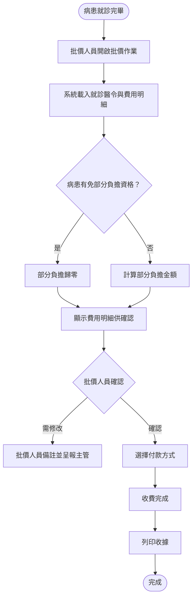
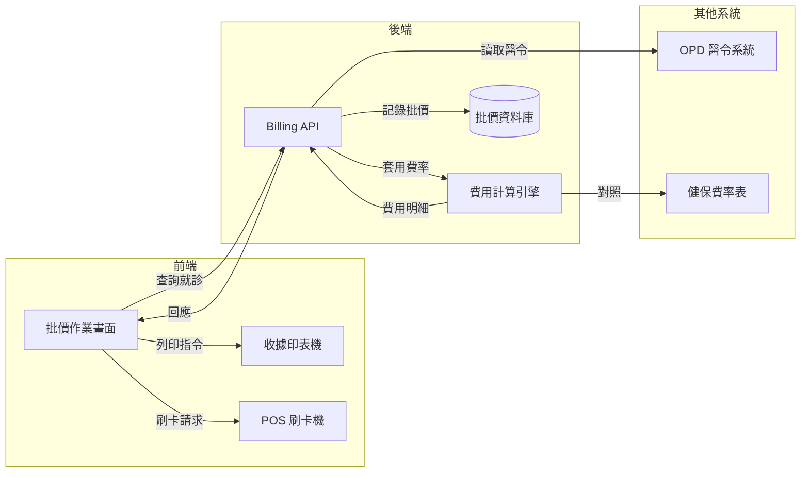

# 【範例】門診批價作業 PRD

> ⚠️ **本文件為 PRD 撰寫參考範例，非正式需求文件，不可作為研發實作依據。**

## 文件資訊

| 欄位 | 內容 |
|-----|-----|
| 所屬系統 | Billing 批價系統 |
| 版本 | 1.0 |
| 作者 | PM 範例 |
| 建立日期 | 2026-05-07 |
| 最後更新 | 2026-05-07 |
| 狀態 | ✅ 內部審核通過 |

---

## 1. Change History｜修訂紀錄

| Version | Date | Author | Description |
|---------|------|--------|-------------|
| 1.0 | 2026-05-07 | PM 範例 | 初版建立（範例文件） |

---

## 2. Requirement Overview｜需求概述

### 2.1 背景與目的

病患就診後，批價人員需依照醫師醫令計算本次就診費用，包含健保給付、自費項目與部分負擔，並開立收據。現有作業中，費用計算規則複雜（需對照健保點數表），人工計算錯誤率高，且無法即時顯示病患的免部分負擔身份，導致退費或補收情況頻繁。

本 PRD 定義「門診批價作業」，系統自動依醫令內容計算費用，批價人員確認後收費並開立收據。

### 2.2 目標與範疇

**目標（Goals）**

- [ ] 系統自動拆算健保與自費費用，批價人員不需手動計算
- [ ] 自動識別病患免部分負擔資格（重大傷病、低收入戶等）
- [ ] 批價完成後即時開立收據並支援多元付款方式

**範疇內（In Scope）**

- 門診費用自動計算（依健保點數表）
- 部分負擔自動判斷
- 收費與收據列印
- 退費作業（當日退費）

**範疇外（Out of Scope）**

- 急診批價（另一 PRD）
- 住院結帳（另一 PRD）
- 健保申報作業（由 Declare 系統處理）

### 2.3 目標使用者（Target Users）

| 角色 | 描述 | 主要操作情境 |
|-----|-----|------------|
| 批價人員 | 醫院批價櫃台服務人員 | 病患就診後執行批價收費 |
| 批價主管 | 批價作業主管 | 審核退費申請 |

### 2.4 非功能需求（Non-functional Requirements）

| 類型 | 需求說明 |
|-----|---------|
| 效能 | 費用計算須於 2 秒內完成 |
| 安全性 | 退費操作需主管帳號授權；所有批價紀錄不可刪除，只能作廢 |
| 相容性 | 支援熱感收據印表機（ESC/POS 指令集）；支援 POS 刷卡機介接 |
| 可用性 | 門診時段（08:00–17:00）系統可用率 ≥ 99.9% |

---

## 3. Business Flow Overview｜業務流程概觀

### 3.1 流程圖

### 3.2 流程步驟說明

| 步驟 | 執行角色 | 動作描述 | 備註 |
|-----|--------|---------|-----|
| 1 | 批價人員 | 搜尋病患當日就診紀錄 | 依病歷號或姓名查詢 |
| 2 | 系統 | 自動計算健保點數、自費金額、部分負擔 | 依健保點數表當季費率 |
| 3 | 批價人員 | 確認費用明細 | 如有疑問可查看明細項目 |
| 4 | 批價人員 | 向病患收費 | 支援現金、信用卡、行動支付 |
| 5 | 系統 | 開立收據並記錄批價完成 | |

### 3.3 與其他系統的互動

| 觸發方向 | 來源系統 | 目標系統 | 互動說明 |
|---------|--------|--------|---------|
| ← | OPD / ER | Billing | 讀取醫令資料以計算費用 |
| → | Billing | Declare | 批價完成後，費用資料傳至申報系統 |

---

## 4. Data Flow Overview｜資料流程概觀

### 4.1 資料流程圖

### 4.2 關鍵資料項目

| 資料名稱 | 說明 | 來源 | 格式／長度 | 必填 |
|---------|-----|-----|----------|-----|
| 就診序號 | 此次就診的唯一識別碼 | OPD 系統 | 系統產生 | 是 |
| 健保點數 | 健保給付點數 | 費用計算引擎 | 整數 | 是 |
| 自費金額 | 非健保給付費用 | 費用計算引擎 | 整數，元 | 是 |
| 部分負擔金額 | 病患須自付的部分 | 費用計算引擎 | 整數，元 | 是 |
| 免部分負擔代碼 | 重大傷病/低收入等 | 病患基本資料 | 代碼 2 碼 | 否 |
| 付款方式 | 現金/信用卡/行動支付 | 批價人員選擇 | 代碼 1 碼 | 是 |

### 4.3 API／介接規格

| API 端點 | 方法 | 說明 | 主要參數 |
|---------|-----|-----|--------|
| `/api/v1/billing/calculate` | POST | 費用試算 | `visitId`, `patientId` |
| `/api/v1/billing/confirm` | POST | 確認收費 | `visitId`, `paymentMethod`, `amount` |
| `/api/v1/billing/refund` | POST | 退費申請 | `billingId`, `reason`, `supervisorId` |

---

## 5. Use Cases｜使用案例含 UI 與規格說明

---

### UC-01｜門診費用計算與收費

**角色（Actor）：** 批價人員

**前置條件（Preconditions）：**
- 病患門診就診已完成，醫師已完診並送出醫令
- 批價人員已登入並具備「門診批價」權限

**後置條件（Postconditions）：**
- 批價紀錄寫入系統，就診狀態更新為「已批價」
- 收據列印完成

---

#### 5.1.1 操作流程（Main Flow）

| 步驟 | 使用者動作 | 系統回應 |
|-----|---------|--------|
| 1 | 輸入病歷號或姓名查詢當日就診清單 | 顯示符合條件的待批價就診清單 |
| 2 | 點選欲批價的就診紀錄 | 自動計算並顯示費用明細（健保點數、自費、部分負擔） |
| 3 | 確認費用明細無誤 | — |
| 4 | 選擇付款方式（現金/刷卡/行動支付） | 若選刷卡，傳送金額至 POS 機 |
| 5 | 確認收費完成 | 記錄批價，更新就診狀態，觸發列印收據 |

**例外流程（Exception Flow）：**

| 情境 | 觸發條件 | 系統處理方式 |
|-----|--------|-----------|
| 醫令未完診 | 醫師未送出醫令 | 顯示「尚有未完診醫令，無法批價」，拒絕開啟批價 |
| 費用有疑義 | 批價人員認為費用計算有誤 | 提供「標記疑義」功能，進入主管審核流程，暫不收費 |
| POS 機無回應 | 刷卡機離線 | 提示刷卡機異常，提供改為現金收費的選項 |

---

#### 5.1.2 UI 畫面參考

- **Figma 連結：** `（請填入 Figma 連結）`
- **畫面說明：**
  - **待批價清單**：左側列出當日待批價就診，右側顯示費用明細
  - **費用明細**：依項目分列（診察費、藥費、處置費等），底部顯示各小計與總計
  - **收費確認彈窗**：顯示付款方式、實收金額、找零

---

#### 5.1.3 欄位與互動規格（Spec）

| 元件 | 類型 | 說明 | 驗證規則 | 必填 |
|-----|-----|-----|--------|-----|
| 病患查詢框 | 文字輸入 | 支援病歷號或姓名 | — | 是 |
| 費用明細表 | 唯讀表格 | 系統自動帶入，不可手動修改 | — | — |
| 付款方式 | 單選按鈕 | 現金 / 信用卡 / 行動支付 | 必選一項 | 是 |
| 實收金額 | 數字輸入 | 現金收費時輸入收取金額，系統計算找零 | ≥ 應收金額 | 是（現金時） |
| 確認收費 | 主要按鈕 | 點擊後不可取消，需二次確認 | — | — |

**業務規則（Business Rules）：**

- BR-01：同一就診只能批價一次；若需更正，須透過退費後重新批價
- BR-02：重大傷病（持有效重大傷病卡）門診部分負擔歸零
- BR-03：退費須在當日批價完成後 24 小時內提出，且需主管帳號授權

---

## 6. Test Cases｜測試案例

| TC ID | 對應 UC | 測試情境 | 前置條件 | 測試步驟 | 預期結果 | 優先級 |
|-------|--------|---------|--------|---------|--------|------|
| TC-01 | UC-01 | 一般病患門診收費（現金） | 醫師已完診送出醫令 | 1. 查詢就診 2. 確認費用 3. 選現金 4. 輸入收取金額 5. 確認 | 收費成功，顯示找零，列印收據 | P0 |
| TC-02 | UC-01 | 重大傷病病患部分負擔歸零 | 病患具有效重大傷病卡 | 1. 查詢就診 2. 確認費用明細 | 部分負擔顯示為 0 元 | P0 |
| TC-03 | UC-01 | 刷卡付款 | POS 機正常連線 | 1. 選信用卡 2. 確認金額傳至 POS 3. 完成刷卡 | POS 機顯示正確金額，收費成功 | P1 |
| TC-04 | UC-01 | 醫令未完診無法批價 | 醫師尚未送出醫令 | 1. 查詢就診 2. 嘗試點選批價 | 顯示警告，無法開啟批價作業 | P0 |
| TC-05 | UC-01 | 重複批價防呆 | 同一就診已批價完成 | 1. 再次查詢同一就診 | 就診狀態顯示「已批價」，不出現於待批價清單 | P0 |
