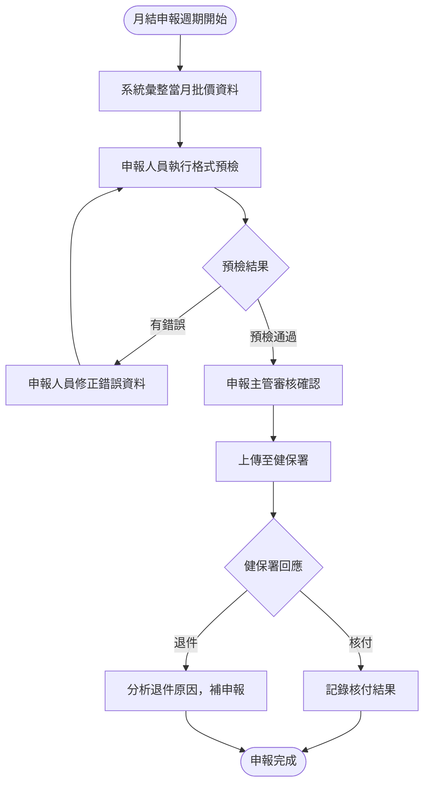
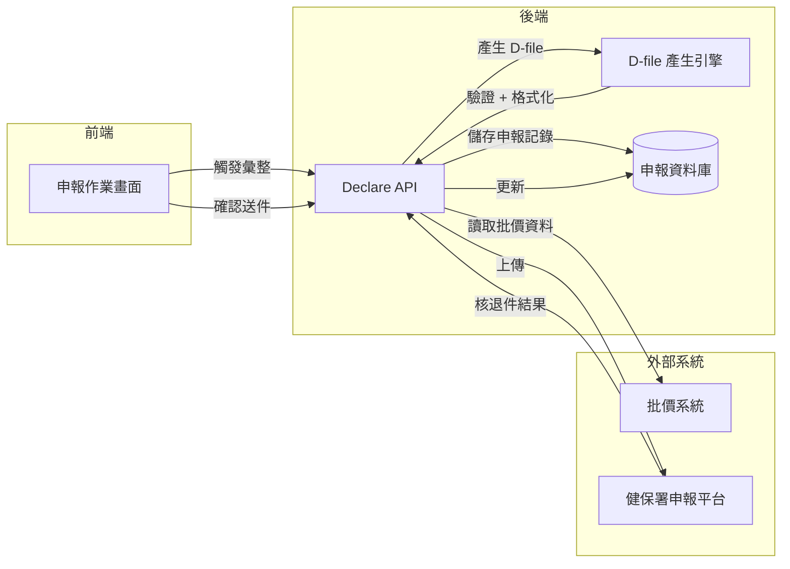

# 【範例】健保費用申報作業 PRD

> ⚠️ **本文件為 PRD 撰寫參考範例，非正式需求文件，不可作為研發實作依據。**

## 文件資訊

| 欄位 | 內容 |
|-----|-----|
| 所屬系統 | Declare 申報系統 |
| 版本 | 1.0 |
| 作者 | PM 範例 |
| 建立日期 | 2026-05-07 |
| 最後更新 | 2026-05-07 |
| 狀態 | ✅ 內部審核通過 |

---

## 1. Change History｜修訂紀錄

| Version | Date | Author | Description |
|---------|------|--------|-------------|
| 1.0 | 2026-05-07 | PM 範例 | 初版建立（範例文件） |

---

## 2. Requirement Overview｜需求概述

### 2.1 背景與目的

醫院每月需在健保署規定期限前完成健保費用申報，申報資料需從批價系統彙整，並轉換為健保署規定的 IC 申報格式（D-file）。目前作業流程需人工逐一核對申報資料，錯誤率高，且格式驗證只能在送件後從健保署退件通知得知，修正時間緊迫。

本 PRD 定義健保費用申報作業，系統自動彙整批價資料、進行格式預檢，申報人員確認後上傳至健保署。

### 2.2 目標與範疇

**目標（Goals）**

- [ ] 系統自動彙整批價完成的就診資料，生成申報清冊
- [ ] 上傳前進行申報格式預檢（D-file 格式驗證），降低退件率
- [ ] 申報結果（核付 / 退件）匯入系統並追蹤處理進度

**範疇內（In Scope）**

- 申報資料彙整（門診、急診、住院）
- D-file 格式驗證與產生
- 健保署電子申報上傳
- 核退件追蹤

**範疇外（Out of Scope）**

- 自費項目申報（另一流程）
- 健保點值換算（財務系統處理）

### 2.3 目標使用者（Target Users）

| 角色 | 描述 | 主要操作情境 |
|-----|-----|------------|
| 申報人員 | 醫院健保申報作業人員 | 每月執行月結申報 |
| 申報主管 | 申報作業主管 | 送件前最終審核確認 |

### 2.4 非功能需求（Non-functional Requirements）

| 類型 | 需求說明 |
|-----|---------|
| 效能 | D-file 產生（全月資料）< 5 分鐘 |
| 安全性 | 申報資料上傳使用健保署憑證加密；操作記錄不可刪除 |
| 相容性 | 支援健保署 VPN 環境下的上傳作業 |
| 可用性 | 月底申報截止日前 3 天系統可用率 ≥ 99.9% |

---

## 3. Business Flow Overview｜業務流程概觀

### 3.1 流程圖

### 3.2 流程步驟說明

| 步驟 | 執行角色 | 動作描述 | 備註 |
|-----|--------|---------|-----|
| 1 | 系統 | 月結時自動彙整批價完成的就診資料 | 每月 1 日凌晨自動執行 |
| 2 | 申報人員 | 執行 D-file 格式預檢，查看錯誤清單 | |
| 3 | 申報人員 | 修正錯誤資料（通知相關科室補正） | |
| 4 | 申報主管 | 確認資料無誤後授權送件 | |
| 5 | 系統 | 加密並上傳至健保署電子申報平台 | |
| 6 | 系統 | 下載健保署核退件結果並匯入 | |

### 3.3 與其他系統的互動

| 觸發方向 | 來源系統 | 目標系統 | 互動說明 |
|---------|--------|--------|---------|
| ← | Declare | Billing | 讀取批價完成的費用明細 |
| → | Declare | 健保署電子申報平台 | 上傳 D-file |
| ← | Declare | 健保署電子申報平台 | 下載核退件結果 |

---

## 4. Data Flow Overview｜資料流程概觀

### 4.1 資料流程圖

### 4.2 關鍵資料項目

| 資料名稱 | 說明 | 來源 | 格式／長度 | 必填 |
|---------|-----|-----|----------|-----|
| 就診序號 | 每筆申報資料的唯一識別 | 批價系統 | 系統產生 | 是 |
| 健保申報碼 | 健保給付項目代碼 | 批價系統 | 依健保費率表 | 是 |
| 點數 | 健保給付點數 | 批價系統計算 | 整數 | 是 |
| ICD-10 診斷碼 | 主診斷與次診斷 | OPD/ER/IPD 醫令系統 | ICD-10-CM 格式 | 是 |
| 申報月份 | 申報所屬月份 | 系統帶入 | YYYYMM | 是 |
| D-file 版本 | 健保署規定格式版本 | 系統設定 | 版本代碼 | 是 |

### 4.3 API／介接規格

| API 端點 | 方法 | 說明 | 主要參數 |
|---------|-----|-----|--------|
| `/api/v1/declare/compile` | POST | 彙整申報資料 | `yearMonth`, `type` |
| `/api/v1/declare/validate` | POST | 執行格式預檢 | `declareId` |
| `/api/v1/declare/submit` | POST | 上傳至健保署 | `declareId`, `supervisorId` |

---

## 5. Use Cases｜使用案例含 UI 與規格說明

---

### UC-01｜申報人員執行月結格式預檢與送件

**角色（Actor）：** 申報人員 / 申報主管

**前置條件（Preconditions）：**
- 當月批價作業已完成
- 申報人員已登入，具備「申報作業」權限

**後置條件（Postconditions）：**
- 申報資料成功上傳至健保署，申報狀態更新為「已送件」

---

#### 5.1.1 操作流程（Main Flow）

| 步驟 | 使用者動作 | 系統回應 |
|-----|---------|--------|
| 1 | 選取申報月份，點選「彙整申報資料」 | 從批價系統彙整資料，顯示筆數與點數統計 |
| 2 | 點選「執行格式預檢」 | 產生 D-file 並驗證，顯示錯誤清單（含錯誤碼與說明） |
| 3 | 依錯誤清單修正對應資料，重新執行預檢 | — |
| 4 | 預檢通過後，申報主管登入審核並點選「授權送件」 | 顯示送件確認畫面（總筆數、總點數） |
| 5 | 確認送件 | 系統加密 D-file 並上傳至健保署；顯示上傳結果 |

**例外流程（Exception Flow）：**

| 情境 | 觸發條件 | 系統處理方式 |
|-----|--------|-----------|
| 健保署平台連線失敗 | 健保署 VPN 或平台無回應 | 顯示連線錯誤，建議稍後重試；申報資料保留，不重複送件 |
| 有批價資料尚未完成 | 彙整時發現有未批價的就診 | 警示列出未批價清單，允許繼續送件（未批價資料不納入此次申報） |

---

#### 5.1.2 UI 畫面參考

- **Figma 連結：** `（請填入 Figma 連結）`
- **畫面說明：**
  - **統計摘要區**：顯示本月申報筆數、總點數，與上月比較
  - **錯誤清單**：逐筆列出格式錯誤，含健保錯誤碼、說明、對應就診序號
  - **送件確認彈窗**：顯示完整統計數字，需主管帳號二次確認

---

#### 5.1.3 欄位與互動規格（Spec）

| 元件 | 類型 | 說明 | 驗證規則 | 必填 |
|-----|-----|-----|--------|-----|
| 申報月份 | 月份選擇 | 預設為上個月，可手動調整 | 不可選未來月份 | 是 |
| 彙整申報資料 | 按鈕 | 點擊後彙整，過程中顯示進度條 | — | — |
| 執行格式預檢 | 按鈕 | 彙整完成後才可點擊 | — | — |
| 授權送件 | 主要按鈕（主管操作） | 僅申報主管權限可點擊 | 預檢無錯誤才可啟用 | — |

**業務規則（Business Rules）：**

- BR-01：同一月份不可重複送件；重送前需作廢前次申報並填寫理由
- BR-02：格式預檢有任一嚴重錯誤（紅色）時，送件按鈕鎖定
- BR-03：申報操作（彙整 / 送件）需在稽核日誌記錄操作人員與時間

---

## 6. Test Cases｜測試案例

| TC ID | 對應 UC | 測試情境 | 前置條件 | 測試步驟 | 預期結果 | 優先級 |
|-------|--------|---------|--------|---------|--------|------|
| TC-01 | UC-01 | 正常完成月結申報 | 批價作業已完成；無格式錯誤 | 1. 選月份 2. 彙整 3. 預檢 4. 主管授權 5. 送件 | 上傳成功，狀態更新為已送件 | P0 |
| TC-02 | UC-01 | 預檢發現錯誤 | 資料中有 ICD-10 碼格式錯誤 | 1. 彙整 2. 執行預檢 | 顯示錯誤清單，送件按鈕鎖定 | P0 |
| TC-03 | UC-01 | 健保署連線失敗 | 健保署平台無回應 | 1. 完成預檢 2. 嘗試送件 | 顯示連線失敗錯誤，申報資料未重複送出 | P1 |
| TC-04 | UC-01 | 重複送件防呆 | 同月份已有送件成功紀錄 | 1. 選取已送件月份 2. 嘗試再次彙整送件 | 警示「本月已完成送件」，阻擋重複申報 | P0 |
