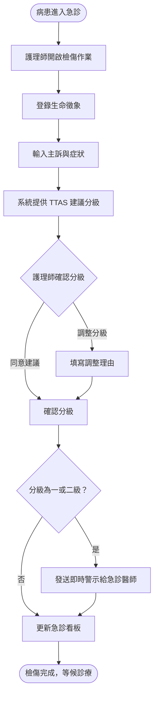
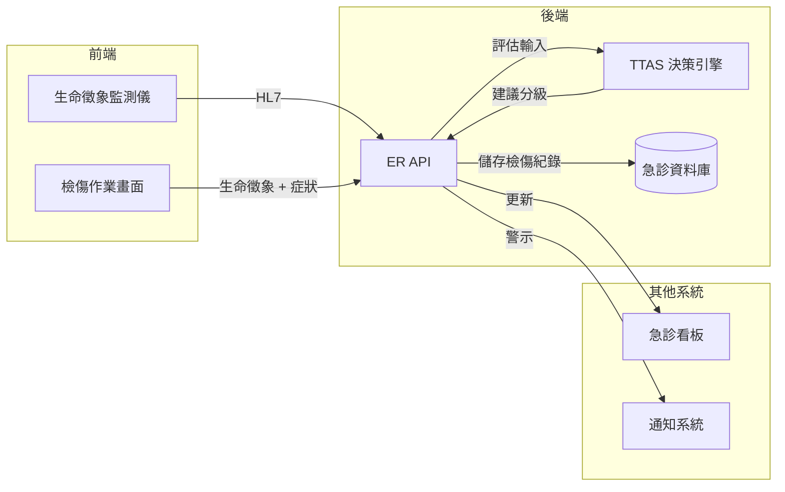

# 【範例】急診檢傷分類作業 PRD

> ⚠️ **本文件為 PRD 撰寫參考範例，非正式需求文件，不可作為研發實作依據。**

## 文件資訊

| 欄位 | 內容 |
|-----|-----|
| 所屬系統 | ER 急診醫令系統 |
| 版本 | 1.0 |
| 作者 | PM 範例 |
| 建立日期 | 2026-05-07 |
| 最後更新 | 2026-05-07 |
| 狀態 | ✅ 內部審核通過 |

---

## 1. Change History｜修訂紀錄

| Version | Date | Author | Description |
|---------|------|--------|-------------|
| 1.0 | 2026-05-07 | PM 範例 | 初版建立（範例文件） |

---

## 2. Requirement Overview｜需求概述

### 2.1 背景與目的

急診檢傷是決定病患優先處置順序的關鍵步驟。目前護理師以紙本或獨立系統記錄檢傷結果，無法即時同步至急診看板，導致醫師無法掌握候診病患的整體狀況，壅塞時容易遺漏病況快速惡化的病患。

本 PRD 定義急診檢傷分類功能，依 TTAS（臺灣檢傷分類系統）五級制完成生命徵象登錄、症狀評估、分級指派，並即時更新急診看板。

### 2.2 目標與範疇

**目標（Goals）**

- [ ] 護理師完成檢傷評估後 1 分鐘內，結果顯示於急診看板
- [ ] 依 TTAS 五級制自動建議分級，護理師可手動調整
- [ ] 第一、二級病患觸發即時警示通知急診醫師

**範疇內（In Scope）**

- 生命徵象登錄
- 主訴與症狀評估（含 TTAS 決策樹導引）
- 檢傷分級（一至五級）
- 急診看板即時更新
- 一、二級病患警示通知

**範疇外（Out of Scope）**

- 急診醫令開立（本系統處理的另一功能）
- 急診留觀床位管理（另一 PRD）

### 2.3 目標使用者（Target Users）

| 角色 | 描述 | 主要操作情境 |
|-----|-----|------------|
| 急診檢傷護理師 | 急診入口檢傷站護理師 | 病患到達急診時執行初步評估與分級 |
| 急診醫師 | 急診診間醫師 | 查看看板並接收高危病患通知 |

### 2.4 非功能需求（Non-functional Requirements）

| 類型 | 需求說明 |
|-----|---------|
| 效能 | 檢傷結果送出至看板更新 < 5 秒 |
| 安全性 | 檢傷紀錄不可刪除，僅可補充說明；操作員帳號需記錄 |
| 相容性 | 支援平板操作（觸控）；支援生命徵象監測儀自動帶入數值（HL7 介面） |
| 可用性 | 24 小時可用率 ≥ 99.9% |

---

## 3. Business Flow Overview｜業務流程概觀

### 3.1 流程圖

### 3.2 流程步驟說明

| 步驟 | 執行角色 | 動作描述 | 備註 |
|-----|--------|---------|-----|
| 1 | 護理師 | 掃描健保卡或輸入身分識別，建立急診就診 | 無健保卡時以姓名+生日建立暫時身份 |
| 2 | 護理師 | 量測並登錄生命徵象（血壓、心跳、體溫、血氧） | 支援儀器自動帶入 |
| 3 | 護理師 | 選擇主訴分類，依系統導引評估症狀 | |
| 4 | 系統 | 依 TTAS 決策樹產生建議分級 | |
| 5 | 護理師 | 確認或調整分級 | 調整須填理由 |
| 6 | 系統 | 更新急診看板；一、二級發送警示 | |

### 3.3 與其他系統的互動

| 觸發方向 | 來源系統 | 目標系統 | 互動說明 |
|---------|--------|--------|---------|
| → | ER | 急診看板 | 即時推送檢傷分級與等候狀態 |
| → | ER | 通知系統 | 一、二級病患觸發醫師 Push 通知 |
| ← | ER | 生命徵象監測儀 | HL7 介面自動帶入生命徵象數值 |

---

## 4. Data Flow Overview｜資料流程概觀

### 4.1 資料流程圖

### 4.2 關鍵資料項目

| 資料名稱 | 說明 | 來源 | 格式／長度 | 必填 |
|---------|-----|-----|----------|-----|
| 收縮壓 / 舒張壓 | 血壓（mmHg） | 儀器帶入或手動輸入 | 整數 | 是 |
| 心跳 | 次/分鐘 | 儀器帶入或手動輸入 | 整數 | 是 |
| 體溫 | 攝氏度 | 儀器帶入或手動輸入 | 小數點一位 | 是 |
| 血氧飽和度（SpO2） | % | 儀器帶入或手動輸入 | 整數 | 是 |
| 主訴 | 病患主要症狀描述 | 護理師選擇 + 自由輸入 | 代碼 + 文字 100 字 | 是 |
| TTAS 分級 | 一至五級 | 系統建議，護理師確認 | 整數 1–5 | 是 |
| 調整理由 | 護理師變更系統建議分級的理由 | 護理師輸入 | 文字 200 字 | 調整時必填 |

### 4.3 API／介接規格

| API 端點 | 方法 | 說明 | 主要參數 |
|---------|-----|-----|--------|
| `/api/v1/er/visits` | POST | 建立急診就診 | `patientId`, `arrivalTime` |
| `/api/v1/er/triage` | POST | 送出檢傷評估 | `visitId`, `vitals`, `chiefComplaint`, `triagleLevel` |
| `/api/v1/er/board` | GET | 取得急診看板資料 | `date`, `status` |

---

## 5. Use Cases｜使用案例含 UI 與規格說明

---

### UC-01｜護理師執行急診檢傷評估

**角色（Actor）：** 急診檢傷護理師

**前置條件（Preconditions）：**
- 護理師已登入，具備「急診檢傷」權限
- 病患已到達急診入口

**後置條件（Postconditions）：**
- 檢傷紀錄儲存，急診看板即時顯示分級與等候資訊
- 一、二級病患通知急診醫師

---

#### 5.1.1 操作流程（Main Flow）

| 步驟 | 使用者動作 | 系統回應 |
|-----|---------|--------|
| 1 | 掃描病患健保卡，建立急診就診 | 帶入病患基本資料，開啟檢傷作業頁面 |
| 2 | 確認生命徵象數值（由監測儀自動帶入或手動輸入） | 異常值（如血壓 > 180）以紅色醒目標示 |
| 3 | 選擇主訴分類（如：胸痛、呼吸困難） | 系統顯示對應的 TTAS 評估問題 |
| 4 | 依系統導引回答評估問題 | 系統計算並顯示建議分級 |
| 5 | 確認分級並送出 | 急診看板即時更新；一、二級觸發醫師通知 |

**例外流程（Exception Flow）：**

| 情境 | 觸發條件 | 系統處理方式 |
|-----|--------|-----------|
| 監測儀介接失敗 | HL7 連線中斷 | 顯示警示，切換為純手動輸入模式 |
| 病患無法提供身份 | 昏迷或無健保卡 | 允許建立無名病患（以流水號暫代），後續補登資料 |
| 護理師調整分級 | 護理師認為建議分級不符病況 | 要求填寫調整理由，調整紀錄永久保存供後續稽核 |

---

#### 5.1.2 UI 畫面參考

- **Figma 連結：** `（請填入 Figma 連結）`
- **畫面說明：**
  - **生命徵象區**：各項數值輸入框，異常值自動變色警示
  - **主訴選擇區**：分類圖示 + 關鍵字搜尋
  - **TTAS 問題導引**：逐步問答介面，右側即時顯示目前建議分級
  - **送出確認**：分級以顏色色塊顯示（一級紅、二級橙、三級黃、四級綠、五級白）

---

#### 5.1.3 欄位與互動規格（Spec）

| 元件 | 類型 | 說明 | 驗證規則 | 必填 |
|-----|-----|-----|--------|-----|
| 收縮壓 | 數字輸入 | mmHg | 整數 40–300；超出範圍標紅 | 是 |
| 舒張壓 | 數字輸入 | mmHg | 整數 20–200 | 是 |
| 心跳 | 數字輸入 | 次/分鐘 | 整數 20–250 | 是 |
| 體溫 | 數字輸入 | °C | 34.0–42.0，小數點一位 | 是 |
| SpO2 | 數字輸入 | % | 整數 50–100 | 是 |
| 主訴分類 | 圖示選擇 | 16 大類主訴 | 必選一項 | 是 |
| TTAS 分級 | 唯讀 + 可修改 | 系統建議值；修改需填理由 | 1–5 整數 | 是 |
| 調整理由 | 文字輸入 | 分級調整時顯示 | 10 字以上 | 調整時必填 |

**業務規則（Business Rules）：**

- BR-01：一、二級分級完成後需在 5 分鐘內通知急診醫師（超時系統自動再次發送通知）
- BR-02：同一就診僅可建立一筆主要檢傷紀錄；如需重新評估，建立補充評估紀錄，原始紀錄保留
- BR-03：生命徵象有任一異常值時，系統自動建議分級不得低於三級

---

## 6. Test Cases｜測試案例

| TC ID | 對應 UC | 測試情境 | 前置條件 | 測試步驟 | 預期結果 | 優先級 |
|-------|--------|---------|--------|---------|--------|------|
| TC-01 | UC-01 | 正常完成檢傷並更新看板 | 護理師登入；監測儀正常 | 1. 掃健保卡 2. 確認生命徵象 3. 選主訴 4. 回答問題 5. 確認分級送出 | 看板即時顯示新病患及分級 | P0 |
| TC-02 | UC-01 | 一級分級觸發醫師通知 | 病患生命徵象危急 | 1. 輸入危急生命徵象 2. 完成評估，建議一級 3. 送出 | 急診醫師在 5 秒內收到 Push 通知 | P0 |
| TC-03 | UC-01 | 護理師手動調升分級 | 系統建議三級，護理師認為應為二級 | 1. 完成評估 2. 手動修改為二級 3. 填寫調整理由 4. 送出 | 分級調整成功，調整紀錄含理由永久保存 | P1 |
| TC-04 | UC-01 | 無名病患建立暫時身份 | 病患昏迷無健保卡 | 1. 選擇「無名病患」 2. 完成評估送出 | 以流水號建立就診，後續可補登身份資料 | P1 |
| TC-05 | UC-01 | 生命徵象監測儀介接失敗 | HL7 連線中斷 | 1. 開啟檢傷作業 | 顯示介接失敗警示，各數值欄位切換為可手動輸入 | P1 |
