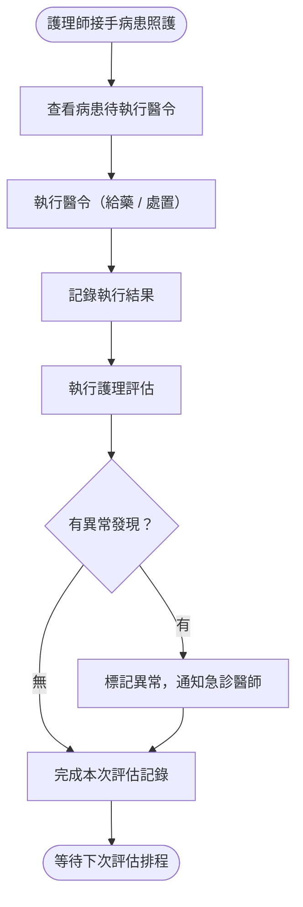
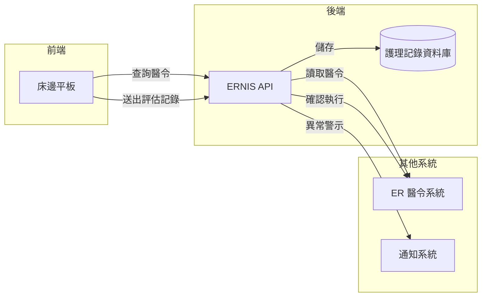

# 【範例】急診護理評估記錄 PRD

> ⚠️ **本文件為 PRD 撰寫參考範例，非正式需求文件，不可作為研發實作依據。**

## 文件資訊

| 欄位 | 內容 |
|-----|-----|
| 所屬系統 | ERNIS 急診護理系統 |
| 版本 | 1.0 |
| 作者 | PM 範例 |
| 建立日期 | 2026-05-07 |
| 最後更新 | 2026-05-07 |
| 狀態 | ✅ 內部審核通過 |

---

## 1. Change History｜修訂紀錄

| Version | Date | Author | Description |
|---------|------|--------|-------------|
| 1.0 | 2026-05-07 | PM 範例 | 初版建立（範例文件） |

---

## 2. Requirement Overview｜需求概述

### 2.1 背景與目的

急診護理師在照護病患期間需定期記錄護理評估（意識狀態、疼痛評估、跌倒風險等），並確認醫師醫令的執行狀態。目前評估記錄以紙本填寫後再補登系統，造成記錄延遲且易遺漏。

本 PRD 定義急診護理評估記錄功能，讓護理師在床邊即時完成結構化評估，並與急診醫令系統整合，確認醫令執行結果。

### 2.2 目標與範疇

**目標（Goals）**

- [ ] 護理師可在床邊平板完成結構化護理評估記錄
- [ ] 疼痛評估、跌倒風險等評估工具直接內建於系統
- [ ] 醫令執行確認與護理評估整合於同一畫面

**範疇內（In Scope）**

- 護理評估記錄（意識、疼痛、跌倒風險）
- 醫令執行確認
- 生命徵象複測記錄

**範疇外（Out of Scope）**

- 急診檢傷分類（ER 系統處理）
- 護理計劃制定（IPDNIS 功能）

### 2.3 目標使用者（Target Users）

| 角色 | 描述 | 主要操作情境 |
|-----|-----|------------|
| 急診護理師 | 急診病房照護護理師 | 執行醫令後記錄評估結果 |
| 急診護理長 | 管理急診護理團隊 | 查閱護理記錄品質 |

### 2.4 非功能需求（Non-functional Requirements）

| 類型 | 需求說明 |
|-----|---------|
| 效能 | 記錄儲存 < 2 秒 |
| 安全性 | 護理記錄不可刪除，僅可補充說明；記錄者帳號永久保存 |
| 相容性 | 優先支援 10 吋平板觸控操作 |
| 可用性 | 24 小時可用率 ≥ 99.9% |

---

## 3. Business Flow Overview｜業務流程概觀

### 3.1 流程圖

### 3.2 流程步驟說明

| 步驟 | 執行角色 | 動作描述 | 備註 |
|-----|--------|---------|-----|
| 1 | 護理師 | 開啟病患床號，查看待執行醫令清單 | |
| 2 | 護理師 | 執行醫令後，在系統確認執行並記錄時間 | |
| 3 | 護理師 | 填寫護理評估（意識、疼痛、跌倒風險） | 評估工具以結構化問卷呈現 |
| 4 | 系統 | 自動計算評估分數並與前次比較 | 分數惡化時標示警示 |
| 5 | 護理師 | 若有異常，備註說明並通知醫師 | |

### 3.3 與其他系統的互動

| 觸發方向 | 來源系統 | 目標系統 | 互動說明 |
|---------|--------|--------|---------|
| ← | ERNIS | ER 醫令系統 | 讀取待執行醫令清單 |
| → | ERNIS | ER 醫令系統 | 回傳醫令執行確認 |
| → | ERNIS | 通知系統 | 異常評估結果通知急診醫師 |

---

## 4. Data Flow Overview｜資料流程概觀

### 4.1 資料流程圖

### 4.2 關鍵資料項目

| 資料名稱 | 說明 | 來源 | 格式／長度 | 必填 |
|---------|-----|-----|----------|-----|
| 意識狀態（GCS） | Glasgow Coma Scale 三項評估 | 護理師評估輸入 | 整數，E+V+M 各分項 | 是 |
| 疼痛分數（NRS） | 數字疼痛評估量表 0–10 | 護理師輸入 | 整數 0–10 | 是 |
| 跌倒風險評估（Morse） | Morse Fall Scale 六項 | 護理師評估輸入 | 各項分數加總 | 是 |
| 醫令執行確認 | 執行時間 + 執行者 | 護理師確認 | Timestamp + 護理師代碼 | 是 |
| 異常備註 | 評估有異常時的補充說明 | 護理師輸入 | 文字 500 字 | 異常時必填 |

### 4.3 API／介接規格

| API 端點 | 方法 | 說明 | 主要參數 |
|---------|-----|-----|--------|
| `/api/v1/ernis/assessments` | POST | 建立護理評估記錄 | `visitId`, `nurseId`, `assessments{}` |
| `/api/v1/ernis/order-confirm` | POST | 確認醫令執行 | `orderId`, `executedAt`, `nurseId` |

---

## 5. Use Cases｜使用案例含 UI 與規格說明

---

### UC-01｜護理師執行醫令後完成護理評估記錄

**角色（Actor）：** 急診護理師

**前置條件（Preconditions）：**
- 護理師已登入，具備「急診護理記錄」權限
- 病患已有急診就診紀錄且有待執行醫令

**後置條件（Postconditions）：**
- 醫令執行狀態更新為「已執行」
- 護理評估記錄儲存，若有異常則通知醫師

---

#### 5.1.1 操作流程（Main Flow）

| 步驟 | 使用者動作 | 系統回應 |
|-----|---------|--------|
| 1 | 在平板選取負責病床的病患 | 顯示病患資料、待執行醫令清單 |
| 2 | 執行醫令後點選「確認執行」 | 記錄執行時間與護理師帳號，醫令狀態更新 |
| 3 | 點選「新增護理評估」 | 顯示結構化評估表單（GCS / 疼痛 / 跌倒風險） |
| 4 | 依病患實際狀況填寫各評估項目 | 自動計算各評估總分，與前次比較並顯示趨勢 |
| 5 | 若有異常填寫備註，點選「送出記錄」 | 記錄儲存；異常評估自動通知負責醫師 |

**例外流程（Exception Flow）：**

| 情境 | 觸發條件 | 系統處理方式 |
|-----|--------|-----------|
| 評估分數急速惡化 | 本次 GCS 比前次下降 3 分以上 | 強制顯示緊急警示畫面，要求填寫備註並確認通知醫師 |
| 醫令逾期未執行 | 醫令預定執行時間超過 30 分鐘 | 醫令清單以紅色標示，提醒護理師優先處理 |

---

#### 5.1.2 UI 畫面參考

- **Figma 連結：** `（請填入 Figma 連結）`
- **畫面說明：**
  - **病患資訊卡**：頁面頂部顯示姓名、床號、分級、入急診時間
  - **待執行醫令區**：條列式清單，逾期醫令標紅
  - **護理評估區**：分頁式評估表單，GCS / 疼痛 / 跌倒風險各為一頁；完成後顯示趨勢圖

---

#### 5.1.3 欄位與互動規格（Spec）

| 元件 | 類型 | 說明 | 驗證規則 | 必填 |
|-----|-----|-----|--------|-----|
| GCS 睜眼反應（E） | 單選按鈕 | 1–4 分 | 必選 | 是 |
| GCS 語言反應（V） | 單選按鈕 | 1–5 分 | 必選 | 是 |
| GCS 動作反應（M） | 單選按鈕 | 1–6 分 | 必選 | 是 |
| 疼痛分數 | 滑桿 + 數字 | NRS 0–10 | 0–10 整數 | 是 |
| Morse 跌倒各項 | 單選按鈕（6 項） | 各項有固定分值 | 必選 | 是 |
| 異常備註 | 文字輸入 | 評估有異常時出現 | 10 字以上 | 異常時必填 |

**業務規則（Business Rules）：**

- BR-01：每位病患至少每 4 小時需有一筆護理評估記錄；超過 4 小時未記錄時在病患清單顯示警示
- BR-02：GCS ≤ 8 分自動觸發高風險警示，強制通知急診醫師
- BR-03：護理評估記錄一旦送出不可修改，若有錯誤需新建「更正記錄」並說明更正原因

---

## 6. Test Cases｜測試案例

| TC ID | 對應 UC | 測試情境 | 前置條件 | 測試步驟 | 預期結果 | 優先級 |
|-------|--------|---------|--------|---------|--------|------|
| TC-01 | UC-01 | 正常完成護理評估 | 病患有待執行醫令 | 1. 選病患 2. 確認醫令執行 3. 填寫評估 4. 送出 | 記錄儲存，醫令狀態更新 | P0 |
| TC-02 | UC-01 | GCS 惡化觸發緊急警示 | 病患前次 GCS 為 12 | 1. 填寫本次 GCS 為 8 | 顯示緊急警示，強制填寫備註並通知醫師 | P0 |
| TC-03 | UC-01 | 逾期醫令標示提醒 | 醫令預定執行時間已過 30 分鐘 | 1. 開啟病患醫令清單 | 逾期醫令顯示紅色，排列於清單頂端 | P1 |
| TC-04 | UC-01 | 超過 4 小時未記錄警示 | 病患上次評估超過 4 小時前 | 1. 在病患清單查看 | 病患卡片顯示「評估逾時」警示 | P1 |
