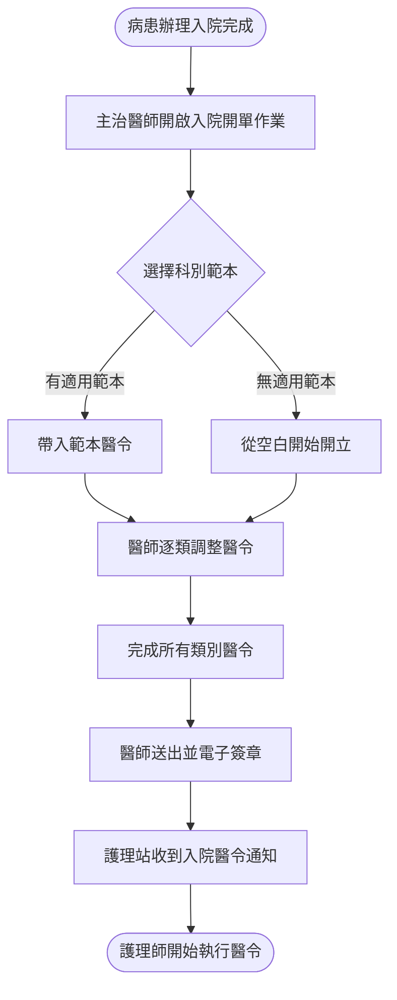
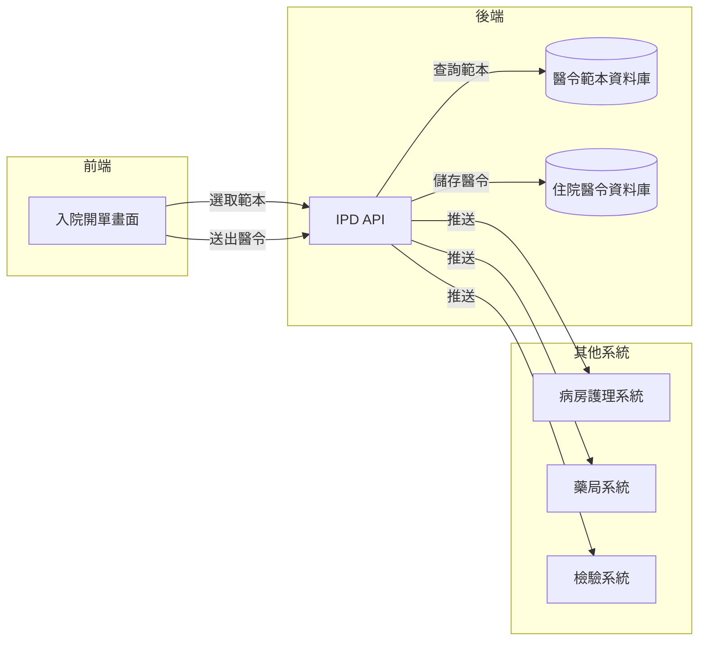

# 【範例】住院入院開單作業 PRD

> ⚠️ **本文件為 PRD 撰寫參考範例，非正式需求文件，不可作為研發實作依據。**

## 文件資訊

| 欄位 | 內容 |
|-----|-----|
| 所屬系統 | IPD 住院醫令系統 |
| 版本 | 1.0 |
| 作者 | PM 範例 |
| 建立日期 | 2026-05-07 |
| 最後更新 | 2026-05-07 |
| 狀態 | ✅ 內部審核通過 |

---

## 1. Change History｜修訂紀錄

| Version | Date | Author | Description |
|---------|------|--------|-------------|
| 1.0 | 2026-05-07 | PM 範例 | 初版建立（範例文件） |

---

## 2. Requirement Overview｜需求概述

### 2.1 背景與目的

病患住院時，主治醫師需開立一套入院醫令（Admission Order），包含飲食、活動、護理常規、基本藥物、例行檢查等。目前醫師需逐項手動輸入，缺乏科別標準化範本，同科入院醫令內容差異大，導致護理師需頻繁與醫師確認，影響入院效率。

本 PRD 定義住院入院開單作業，提供科別標準化入院醫令範本，醫師可快速帶入並個別調整，提升入院作業效率與品質一致性。

### 2.2 目標與範疇

**目標（Goals）**

- [ ] 提供科別入院醫令範本，醫師可一鍵帶入並修改
- [ ] 入院醫令涵蓋飲食、活動、護理常規、藥物、檢驗等類別
- [ ] 醫令送出後護理站即時收到入院醫令通知

**範疇內（In Scope）**

- 入院醫令範本管理（依科別）
- 入院醫令開立（飲食 / 活動 / 護理常規 / 藥物 / 檢驗）
- 醫令送出通知護理站

**範疇外（Out of Scope）**

- 住院長期醫令的日常維護（另一 PRD）
- 床位安排作業（床管系統處理）

### 2.3 目標使用者（Target Users）

| 角色 | 描述 | 主要操作情境 |
|-----|-----|------------|
| 主治醫師 | 負責住院病患的主治醫師 | 病患辦理入院時開立入院醫令 |
| 病房護理師 | 病房護理站護理師 | 接收入院醫令並執行護理常規 |

### 2.4 非功能需求（Non-functional Requirements）

| 類型 | 需求說明 |
|-----|---------|
| 效能 | 範本載入 < 2 秒；醫令送出 < 3 秒 |
| 安全性 | 入院醫令需主治醫師帳號電子簽章；範本異動留存稽核紀錄 |
| 相容性 | 支援桌機與筆電操作 |
| 可用性 | 全日 24 小時可用率 ≥ 99.5% |

---

## 3. Business Flow Overview｜業務流程概觀

### 3.1 流程圖

### 3.2 流程步驟說明

| 步驟 | 執行角色 | 動作描述 | 備註 |
|-----|--------|---------|-----|
| 1 | 主治醫師 | 從住院病患清單選取新入院病患 | |
| 2 | 主治醫師 | 選擇適用的科別入院醫令範本 | 可選多個範本合併 |
| 3 | 主治醫師 | 依病患狀況調整各類醫令內容 | |
| 4 | 主治醫師 | 送出並完成電子簽章 | |
| 5 | 系統 | 通知病患所在病房護理站 | Push 通知 + 護理站看板更新 |
| 6 | 護理師 | 確認收到入院醫令，開始執行 | |

### 3.3 與其他系統的互動

| 觸發方向 | 來源系統 | 目標系統 | 互動說明 |
|---------|--------|--------|---------|
| → | IPD | IPDNIS | 入院醫令推送至病房護理系統 |
| → | IPD | Pharmacy | 入院藥物醫令傳送至藥局 |
| → | IPD | 檢驗系統 | 入院例行檢驗醫令建立採檢任務 |

---

## 4. Data Flow Overview｜資料流程概觀

### 4.1 資料流程圖

### 4.2 關鍵資料項目

| 資料名稱 | 說明 | 來源 | 格式／長度 | 必填 |
|---------|-----|-----|----------|-----|
| 飲食醫令 | 飲食種類（普食/軟食/流質等） | 醫師選擇 | 代碼 | 是 |
| 活動醫令 | 活動限制（完全臥床/下床活動等） | 醫師選擇 | 代碼 | 是 |
| 護理常規 | 生命徵象量測頻率、傷口護理等 | 醫師填寫 + 範本帶入 | 代碼 + 文字 | 是 |
| 藥物醫令 | 入院常規用藥 | 醫師開立 | 藥品代碼 + 劑量規格 | 否 |
| 檢驗醫令 | 入院例行抽血 / 影像 | 醫師開立 | 檢驗代碼 | 否 |
| 電子簽章 | 醫師數位簽章 | 系統自動附加（依登入帳號） | 簽章字串 | 是 |

### 4.3 API／介接規格

| API 端點 | 方法 | 說明 | 主要參數 |
|---------|-----|-----|--------|
| `/api/v1/ipd/templates` | GET | 取得科別範本清單 | `deptCode` |
| `/api/v1/ipd/admission-orders` | POST | 建立入院醫令 | `admissionId`, `orders[]`, `signature` |

---

## 5. Use Cases｜使用案例含 UI 與規格說明

---

### UC-01｜主治醫師使用範本開立入院醫令

**角色（Actor）：** 主治醫師

**前置條件（Preconditions）：**
- 病患已完成入院手續，病歷號已建立
- 醫師已登入，具備「住院醫令開立」權限
- 當科已有建立入院醫令範本

**後置條件（Postconditions）：**
- 入院醫令儲存並完成電子簽章
- 病房護理站收到入院醫令通知

---

#### 5.1.1 操作流程（Main Flow）

| 步驟 | 使用者動作 | 系統回應 |
|-----|---------|--------|
| 1 | 從住院病患清單選取新入院病患 | 載入病患基本資料及病史 |
| 2 | 點選「使用入院範本」，選擇對應科別範本 | 帶入範本內的各類醫令，顯示可編輯清單 |
| 3 | 依病患狀況修改飲食、活動、護理常規醫令 | 各欄位依選擇即時更新 |
| 4 | 新增 / 修改藥物及檢驗醫令（視需要） | 藥物醫令執行 CDSS 檢核 |
| 5 | 點選「送出入院醫令」 | 顯示完整醫令確認清單 |
| 6 | 確認後完成電子簽章送出 | 醫令儲存，護理站收到通知 |

**例外流程（Exception Flow）：**

| 情境 | 觸發條件 | 系統處理方式 |
|-----|--------|-----------|
| 藥物 CDSS 警示 | 入院藥物與病患過去過敏紀錄衝突 | 顯示過敏警示（危險等級），需醫師填寫理由才可繼續 |
| 飲食醫令未填 | 送出時飲食醫令為空 | 系統警示「飲食醫令未填寫」，需確認才可送出 |

---

#### 5.1.2 UI 畫面參考

- **Figma 連結：** `（請填入 Figma 連結）`
- **畫面說明：**
  - **頁面上方**：病患資訊卡（姓名、年齡、入院日期、主診斷）
  - **醫令區域**：以 Tab 分隔五大類（飲食 / 活動 / 護理常規 / 藥物 / 檢驗），各 Tab 獨立編輯
  - **右側摘要欄**：即時顯示已填寫的醫令總覽

---

#### 5.1.3 欄位與互動規格（Spec）

| 元件 | 類型 | 說明 | 驗證規則 | 必填 |
|-----|-----|-----|--------|-----|
| 範本選擇 | 下拉選單 | 依登入醫師的科別篩選可用範本 | — | 否（可跳過） |
| 飲食種類 | 下拉選單 | 普食 / 糖尿病飲食 / 流質等 | 必選 | 是 |
| 活動限制 | 下拉選單 | 完全臥床 / 協助下床 / 自行活動 | 必選 | 是 |
| 生命徵象頻率 | 下拉選單 | Q1H / Q4H / QD 等 | 必選 | 是 |
| 藥物醫令 | 同 OPD 醫令開立 | 參見 OPD PRD UC-01 規格 | — | 否 |
| 電子簽章 | 系統自動 | 送出時自動附加當前登入醫師的簽章 | — | 是（自動） |

**業務規則（Business Rules）：**

- BR-01：飲食與活動醫令為入院醫令必填項目，缺少任一無法送出
- BR-02：入院醫令送出後不可整份作廢，僅可針對個別醫令發出「停用」指令
- BR-03：範本由科主任或授權護理長建立與維護，一般醫師無法修改範本內容

---

## 6. Test Cases｜測試案例

| TC ID | 對應 UC | 測試情境 | 前置條件 | 測試步驟 | 預期結果 | 優先級 |
|-------|--------|---------|--------|---------|--------|------|
| TC-01 | UC-01 | 使用範本完成入院開單 | 當科有入院範本；病患已入院 | 1. 選病患 2. 選範本 3. 調整飲食活動 4. 送出簽章 | 醫令儲存成功，護理站收到通知 | P0 |
| TC-02 | UC-01 | 飲食醫令未填無法送出 | — | 1. 選病患 2. 略過飲食選擇 3. 直接送出 | 系統警示飲食醫令未填，阻擋送出 | P0 |
| TC-03 | UC-01 | 入院藥物過敏警示 | 病患有藥物過敏紀錄 | 1. 開立含過敏藥物的醫令 2. 嘗試送出 | 顯示紅色過敏警示，需填理由才可繼續 | P0 |
| TC-04 | UC-01 | 無範本時從空白開立 | 當科無入院範本 | 1. 選病患 2. 手動填寫各類醫令 3. 送出 | 醫令儲存成功 | P1 |
