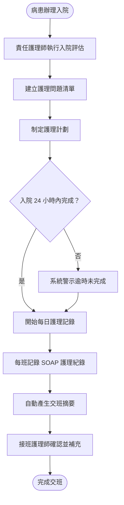
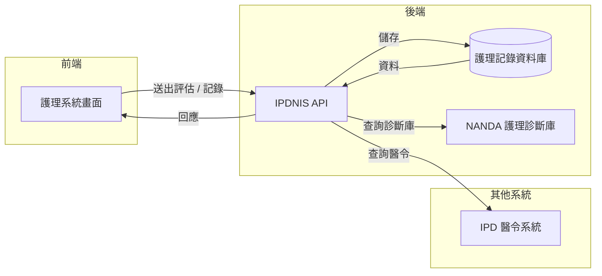

# 【範例】住院護理計劃與記錄 PRD

> ⚠️ **本文件為 PRD 撰寫參考範例，非正式需求文件，不可作為研發實作依據。**

## 文件資訊

| 欄位 | 內容 |
|-----|-----|
| 所屬系統 | IPDNIS 住院護理系統 |
| 版本 | 1.0 |
| 作者 | PM 範例 |
| 建立日期 | 2026-05-07 |
| 最後更新 | 2026-05-07 |
| 狀態 | ✅ 內部審核通過 |

---

## 1. Change History｜修訂紀錄

| Version | Date | Author | Description |
|---------|------|--------|-------------|
| 1.0 | 2026-05-07 | PM 範例 | 初版建立（範例文件） |

---

## 2. Requirement Overview｜需求概述

### 2.1 背景與目的

住院護理師需在病患入院後建立護理計劃，並在住院期間持續記錄護理評估與照護措施。目前護理計劃以紙本記錄為主，交班時資訊交接不完整，且法規要求的護理文件（JCI 標準）補齊率不穩定。

本 PRD 定義住院護理計劃建立與每日護理記錄功能，以結構化格式協助護理師完成法規要求文件，並透過交班摘要功能確保照護連續性。

### 2.2 目標與範疇

**目標（Goals）**

- [ ] 入院 24 小時內完成護理計劃建立率達 95%
- [ ] 護理記錄結構化，符合 JCI 評鑑標準
- [ ] 交班摘要由系統自動彙整，護理師補充後一鍵完成交班

**範疇內（In Scope）**

- 入院護理評估（全身系統性評估）
- 護理問題與護理計劃建立
- 每日護理記錄（SOAP 格式）
- 交班摘要產生

**範疇外（Out of Scope）**

- 醫令執行確認（屬另一功能模組）
- 出院護理衛教（另一 PRD）

### 2.3 目標使用者（Target Users）

| 角色 | 描述 | 主要操作情境 |
|-----|-----|------------|
| 病房護理師 | 病房責任制護理師 | 入院評估、每日護理記錄 |
| 護理長 | 負責護理品質管理 | 查閱護理記錄完整性 |

### 2.4 非功能需求（Non-functional Requirements）

| 類型 | 需求說明 |
|-----|---------|
| 效能 | 護理記錄儲存 < 2 秒 |
| 安全性 | 記錄不可刪除；護理師需用個人帳號記錄，共用帳號不允許 |
| 相容性 | 支援護理站桌機與病房推車平板 |
| 可用性 | 24 小時可用率 ≥ 99.5% |

---

## 3. Business Flow Overview｜業務流程概觀

### 3.1 流程圖

### 3.2 流程步驟說明

| 步驟 | 執行角色 | 動作描述 | 備註 |
|-----|--------|---------|-----|
| 1 | 責任護理師 | 入院後 24 小時內完成全身性護理評估 | |
| 2 | 責任護理師 | 依評估結果建立護理問題，系統提供標準問題庫 | NANDA 護理診斷 |
| 3 | 責任護理師 | 為每個護理問題制定目標與措施 | |
| 4 | 值班護理師 | 每班以 SOAP 格式記錄護理觀察與措施 | |
| 5 | 系統 | 班別結束前自動彙整本班記錄為交班摘要 | |
| 6 | 護理師 | 確認摘要並補充注意事項，完成交班 | |

### 3.3 與其他系統的互動

| 觸發方向 | 來源系統 | 目標系統 | 互動說明 |
|---------|--------|--------|---------|
| ← | IPDNIS | IPD 醫令系統 | 讀取入院醫令作為護理計劃依據 |
| → | IPDNIS | 評鑑文件系統 | 輸出符合 JCI 格式的護理文件 |

---

## 4. Data Flow Overview｜資料流程概觀

### 4.1 資料流程圖

### 4.2 關鍵資料項目

| 資料名稱 | 說明 | 來源 | 格式／長度 | 必填 |
|---------|-----|-----|----------|-----|
| 入院護理評估 | 全身系統性評估（神經 / 呼吸 / 循環等） | 護理師輸入 | 結構化表單 | 是 |
| 護理問題 | NANDA 護理診斷代碼與描述 | 護理師選擇（診斷庫） | 代碼 + 文字 | 是（至少 1 項） |
| 護理目標 | 預期病患達成的護理目標 | 護理師輸入 | 文字 200 字 | 是 |
| SOAP 記錄-S | 主觀資料（病患自述） | 護理師輸入 | 文字 | 是 |
| SOAP 記錄-O | 客觀資料（觀察結果、生命徵象） | 護理師輸入 | 文字 | 是 |
| SOAP 記錄-A | 護理評估（問題現況） | 護理師輸入 | 文字 | 是 |
| SOAP 記錄-P | 護理計劃（後續措施） | 護理師輸入 | 文字 | 是 |

### 4.3 API／介接規格

| API 端點 | 方法 | 說明 | 主要參數 |
|---------|-----|-----|--------|
| `/api/v1/ipdnis/assessments` | POST | 建立入院護理評估 | `admissionId`, `nurseId`, `assessment{}` |
| `/api/v1/ipdnis/nursing-plans` | POST | 建立護理計劃 | `admissionId`, `problems[]` |
| `/api/v1/ipdnis/soap-records` | POST | 建立 SOAP 護理記錄 | `admissionId`, `shift`, `soap{}` |

---

## 5. Use Cases｜使用案例含 UI 與規格說明

---

### UC-01｜責任護理師建立入院護理計劃

**角色（Actor）：** 病房護理師

**前置條件（Preconditions）：**
- 病患已完成入院手續，有住院紀錄
- 護理師已登入，具備「住院護理記錄」權限
- 主治醫師已送出入院醫令

**後置條件（Postconditions）：**
- 入院護理評估記錄完成
- 護理問題與護理計劃建立，護理長可查閱

---

#### 5.1.1 操作流程（Main Flow）

| 步驟 | 使用者動作 | 系統回應 |
|-----|---------|--------|
| 1 | 從病床清單選取新入院病患 | 顯示病患資料、入院醫令摘要 |
| 2 | 點選「入院護理評估」，依系統表單評估各身體系統 | 各系統評估結果即時儲存（草稿） |
| 3 | 評估完成後，系統根據評估結果建議相關護理問題 | 顯示建議護理問題清單（NANDA） |
| 4 | 護理師確認 / 修改護理問題，設定護理目標與措施 | — |
| 5 | 點選「完成護理計劃」送出 | 護理計劃狀態更新為「已建立」 |

**例外流程（Exception Flow）：**

| 情境 | 觸發條件 | 系統處理方式 |
|-----|--------|-----------|
| 入院 24 小時逾時 | 病患入院超過 24 小時護理計劃未完成 | 護理長收到通知；病患清單顯示紅色逾時標示 |
| 評估中途中斷 | 護理師關閉頁面未送出 | 系統保存草稿，下次開啟時提示「有未完成的評估草稿」 |

---

#### 5.1.2 UI 畫面參考

- **Figma 連結：** `（請填入 Figma 連結）`
- **畫面說明：**
  - **評估表單**：以身體系統為 Tab（神經 / 呼吸 / 循環 / 皮膚 / 消化等），逐系統填寫
  - **護理問題區**：評估完成後顯示系統建議問題，護理師可勾選、新增或刪除
  - **計劃編輯區**：每個護理問題對應目標與措施欄位

---

#### 5.1.3 欄位與互動規格（Spec）

| 元件 | 類型 | 說明 | 驗證規則 | 必填 |
|-----|-----|-----|--------|-----|
| 各系統評估項目 | 結構化選單 + 文字補充 | 依身體系統分類 | 各系統至少完成一項 | 是 |
| 護理問題 | 多選清單（NANDA 庫） | 支援關鍵字搜尋 | 至少選取一項 | 是 |
| 護理目標 | 文字輸入 | 每個護理問題至少一個目標 | — | 是 |
| 護理措施 | 文字輸入 + 標準措施庫 | 可從標準措施庫選取 | — | 是 |

**業務規則（Business Rules）：**

- BR-01：入院護理評估需在入院後 24 小時內完成，否則觸發護理長通知
- BR-02：護理計劃至少須有一個護理問題，且每個問題至少有一個目標和一個措施
- BR-03：護理記錄完成送出後不可刪除；如有錯誤須建立更正記錄，原記錄保留

---

## 6. Test Cases｜測試案例

| TC ID | 對應 UC | 測試情境 | 前置條件 | 測試步驟 | 預期結果 | 優先級 |
|-------|--------|---------|--------|---------|--------|------|
| TC-01 | UC-01 | 正常完成入院護理計劃 | 病患已入院；醫令已送出 | 1. 選病患 2. 完成各系統評估 3. 確認護理問題 4. 填目標與措施 5. 送出 | 護理計劃建立成功，狀態更新 | P0 |
| TC-02 | UC-01 | 入院 24 小時逾時警示 | 病患入院已超過 24 小時，護理計劃未建立 | 1. 查看病患清單 | 病患卡片顯示紅色「計劃逾時」標示；護理長已收到通知 | P0 |
| TC-03 | UC-01 | 評估中途儲存草稿 | 護理師在評估填到一半時離開 | 1. 填寫部分評估 2. 關閉頁面 3. 重新開啟 | 顯示草稿提示，恢復先前填寫內容 | P1 |
| TC-04 | UC-01 | 護理問題未選取無法送出 | — | 1. 完成評估 2. 清空護理問題 3. 嘗試送出 | 系統警示護理問題不可為空，阻擋送出 | P0 |
