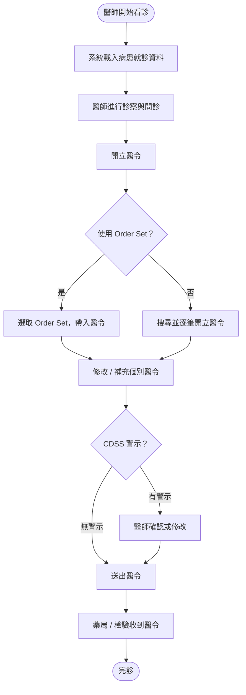

# 【範例】門診醫令開立 PRD

> ⚠️ **本文件為 PRD 撰寫參考範例，非正式需求文件，不可作為研發實作依據。**

## 文件資訊

| 欄位 | 內容 |
|-----|-----|
| 所屬系統 | OPD 門診醫令系統 |
| 版本 | 1.0 |
| 作者 | PM 範例 |
| 建立日期 | 2026-05-07 |
| 最後更新 | 2026-05-07 |
| 狀態 | ✅ 內部審核通過 |

---

## 1. Change History｜修訂紀錄

| Version | Date | Author | Description |
|---------|------|--------|-------------|
| 1.0 | 2026-05-07 | PM 範例 | 初版建立（範例文件） |

---

## 2. Requirement Overview｜需求概述

### 2.1 背景與目的

門診醫師每診需開立大量醫令（用藥、檢驗、處置），現有介面每次需逐筆搜尋藥品或檢驗項目，對診間節奏快速的醫師而言耗時過長。常用醫令無法儲存為個人組合，導致相同診斷每次重複操作。

本 PRD 定義門診醫令開立功能，讓醫師能快速完成藥品處方、檢驗開單、處置醫令，並支援常用醫令組合（Order Set）提升開立效率。

### 2.2 目標與範疇

**目標（Goals）**

- [ ] 醫師可以文字搜尋或分類瀏覽開立藥品、檢驗、處置醫令
- [ ] 支援 Order Set：醫師可儲存常用醫令組合，一鍵帶入
- [ ] 開立完成後自動觸發藥局調劑與檢驗排程

**範疇內（In Scope）**

- 藥品處方開立（含劑量、頻次、天數）
- 檢驗 / 檢查開單
- 處置醫令
- 個人 Order Set 管理

**範疇外（Out of Scope）**

- 手術排程（另一 PRD）
- 急診醫令（ER 系統處理）
- 住院長期醫令（IPD 系統處理）

### 2.3 目標使用者（Target Users）

| 角色 | 描述 | 主要操作情境 |
|-----|-----|------------|
| 門診醫師 | 負責門診診察並開立醫令 | 診察後開立處方與醫令 |
| 診間護理師 | 協助確認與執行醫令 | 確認醫令內容並安排病患處置 |

### 2.4 非功能需求（Non-functional Requirements）

| 類型 | 需求說明 |
|-----|---------|
| 效能 | 藥品搜尋結果 < 1 秒；醫令送出 < 2 秒 |
| 安全性 | 藥品劑量超出安全範圍時顯示警告（CDSS 介接）；醫令由開立醫師帳號簽章 |
| 相容性 | 支援觸控螢幕操作；鍵盤快捷鍵支援常用操作 |
| 可用性 | 門診時段可用率 ≥ 99.9% |

---

## 3. Business Flow Overview｜業務流程概觀

### 3.1 流程圖

### 3.2 流程步驟說明

| 步驟 | 執行角色 | 動作描述 | 備註 |
|-----|--------|---------|-----|
| 1 | 系統 | 自動載入病患當次就診資料、過去病史、用藥紀錄 | |
| 2 | 醫師 | 診察完成後，切換至醫令開立頁面 | |
| 3 | 醫師 | 搜尋藥品 / 選取 Order Set 開立醫令 | |
| 4 | 系統 | 即時 CDSS 藥物交互作用與劑量檢核 | |
| 5 | 醫師 | 確認無誤後送出醫令並完診 | |
| 6 | 系統 | 傳送藥品醫令至藥局、檢驗醫令至檢驗科 | |

### 3.3 與其他系統的互動

| 觸發方向 | 來源系統 | 目標系統 | 互動說明 |
|---------|--------|--------|---------|
| → | OPD | Pharmacy | 藥品醫令傳送至藥局調劑 |
| → | OPD | 檢驗系統 | 檢驗醫令產生檢體採集任務 |
| → | OPD | Billing | 就診完診後，醫令資料供批價使用 |
| ← | OPD | CDSS | 藥物交互作用、過敏、劑量警示 |

---

## 4. Data Flow Overview｜資料流程概觀

### 4.1 資料流程圖

```mermaid
flowchart LR
    subgraph 前端
        UI[門診醫令開立畫面]
    end
    subgraph 後端
        API[OPD API]
        OrderDB[(醫令資料庫)]
        DrugDB[(藥品資料庫)]
    end
    subgraph 外部系統
        CDSS[CDSS 臨床決策支援]
        Pharmacy[Pharmacy 藥局系統]
        Lab[檢驗系統]
    end

    UI -- 搜尋藥品 --> API
    API -- 查詢藥品 --> DrugDB
    UI -- 送出醫令 --> API
    API -- CDSS 檢核 --> CDSS
    CDSS -- 警示結果 --> API
    API -- 儲存醫令 --> OrderDB
    API -- 推送藥品醫令 --> Pharmacy
    API -- 推送檢驗醫令 --> Lab
```

### 4.2 關鍵資料項目

| 資料名稱 | 說明 | 來源 | 格式／長度 | 必填 |
|---------|-----|-----|----------|-----|
| 藥品代碼 | 醫院藥品代碼 | 藥品資料庫 | 英數 10 碼 | 是 |
| 劑量 | 單次給藥劑量 | 醫師輸入 | 數字 + 單位 | 是 |
| 頻次 | 給藥頻率 | 醫師選擇（下拉） | 代碼（如 QD、BID） | 是 |
| 天數 | 給藥天數 | 醫師輸入 | 整數，1–365 | 是 |
| 給藥途徑 | 口服 / 注射等 | 醫師選擇（下拉） | 代碼 2 碼 | 是 |
| 備註 | 特殊用藥說明 | 醫師輸入 | 文字 200 字以內 | 否 |

### 4.3 API／介接規格

| API 端點 | 方法 | 說明 | 主要參數 |
|---------|-----|-----|--------|
| `/api/v1/drugs/search` | GET | 藥品搜尋 | `keyword`, `category` |
| `/api/v1/orders` | POST | 建立醫令 | `visitId`, `orders[]` |
| `/api/v1/ordersets` | GET / POST | 取得 / 儲存 Order Set | `doctorId` |

---

## 5. Use Cases｜使用案例含 UI 與規格說明

---

### UC-01｜醫師開立藥品處方

**角色（Actor）：** 門診醫師

**前置條件（Preconditions）：**
- 病患已掛號且醫師已開啟該診次
- 醫師已登入，具備「門診醫令開立」權限

**後置條件（Postconditions）：**
- 藥品醫令儲存至系統，藥局收到調劑任務
- 就診狀態更新為「醫令已送出」

---

#### 5.1.1 操作流程（Main Flow）

| 步驟 | 使用者動作 | 系統回應 |
|-----|---------|--------|
| 1 | 在搜尋框輸入藥品名稱或代碼 | 即時顯示符合的藥品清單（含常用排序） |
| 2 | 選取欲開立的藥品 | 帶入藥品資料，顯示劑量 / 頻次 / 天數輸入欄位 |
| 3 | 填寫劑量、頻次、天數、給藥途徑 | 系統即時計算總量並顯示 |
| 4 | 點選「加入醫令清單」 | 藥品加入右側醫令清單，CDSS 背景檢核 |
| 5 | 重複步驟 1–4 直到所有藥品開立完畢 | — |
| 6 | 點選「送出醫令」 | 若有 CDSS 警示則顯示警示清單，需確認；無警示則直接送出 |

**例外流程（Exception Flow）：**

| 情境 | 觸發條件 | 系統處理方式 |
|-----|--------|-----------|
| CDSS 藥物交互作用警示 | 開立藥品與現有用藥有交互作用 | 顯示警示說明，醫師可選擇「確認繼續」或「移除藥品」 |
| 藥品庫存不足 | 藥局庫存低於開立數量 | 顯示庫存警示（非阻擋，僅提示） |
| 超出建議劑量 | 輸入劑量超過藥品說明書建議最大劑量 | 顯示紅色警示，需醫師輸入理由才可繼續 |

---

#### 5.1.2 UI 畫面參考

- **Figma 連結：** `（請填入 Figma 連結）`
- **畫面說明：**
  - **左側搜尋區**：藥品關鍵字搜尋 + 分類樹狀結構瀏覽
  - **中央編輯區**：選取藥品後顯示劑量 / 頻次 / 天數 / 途徑輸入
  - **右側醫令清單**：已加入的醫令列表，支援拖曳排序與刪除

---

#### 5.1.3 欄位與互動規格（Spec）

| 元件 | 類型 | 說明 | 驗證規則 | 必填 |
|-----|-----|-----|--------|-----|
| 藥品搜尋框 | 文字輸入 | 支援藥品名稱（中英文）、代碼 | — | 是 |
| 劑量 | 數字輸入 | 輸入數值，單位由藥品資料帶入 | 正數；超出建議最大值需警示 | 是 |
| 頻次 | 下拉選單 | QD / BID / TID / QID / PRN 等 | 必選 | 是 |
| 天數 | 數字輸入 | 給藥天數 | 整數 1–365 | 是 |
| 給藥途徑 | 下拉選單 | 口服 / 外用 / 注射等 | 必選 | 是 |
| 加入醫令清單 | 次要按鈕 | 劑量等必填欄位填寫完成才可點擊 | — | — |
| 送出醫令 | 主要按鈕 | 醫令清單至少有一筆才可點擊 | — | — |

**業務規則（Business Rules）：**

- BR-01：同一就診可開立多筆藥品，不限筆數
- BR-02：CDSS 警示等級分三級：資訊（可直接略過）、警告（需確認）、危險（需輸入理由）
- BR-03：醫令送出後不可刪除，如需修改須開立「停用醫令」

---

## 6. Test Cases｜測試案例

| TC ID | 對應 UC | 測試情境 | 前置條件 | 測試步驟 | 預期結果 | 優先級 |
|-------|--------|---------|--------|---------|--------|------|
| TC-01 | UC-01 | 正常開立藥品並送出 | 病患已掛號，醫師已登入 | 1. 搜尋藥品 2. 填寫劑量頻次天數 3. 加入清單 4. 送出 | 醫令送出成功，藥局收到任務 | P0 |
| TC-02 | UC-01 | CDSS 藥物交互作用警示 | 病患目前有 A 藥，開立與 A 藥有交互作用的 B 藥 | 1. 開立 B 藥 2. 送出 | 顯示交互作用警示，需醫師確認才可送出 | P0 |
| TC-03 | UC-01 | 超出建議劑量警示 | — | 1. 開立藥品 2. 輸入超出建議最大劑量 | 劑量欄位顯示紅色警示，送出需輸入理由 | P0 |
| TC-04 | UC-01 | Order Set 一鍵帶入 | 醫師已有儲存的 Order Set | 1. 選取 Order Set 2. 帶入醫令清單 3. 確認醫令 4. 送出 | 所有 Order Set 內的醫令帶入清單，可個別修改 | P1 |
| TC-05 | UC-01 | 藥品搜尋無結果 | 輸入不存在的藥品代碼 | 1. 輸入查無結果的關鍵字 | 顯示「查無藥品」提示 | P2 |
