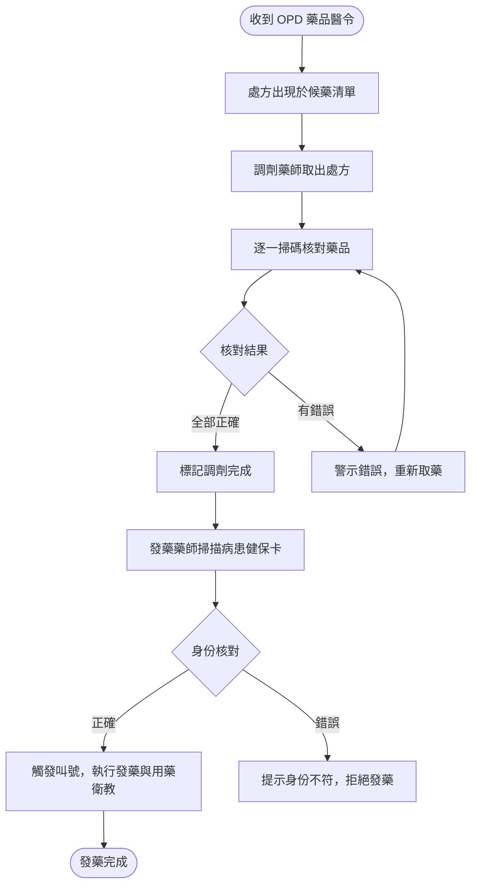
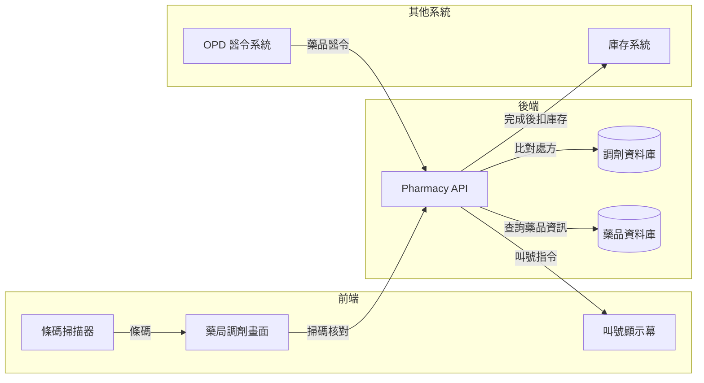

# 【範例】門診藥品調劑作業 PRD

> ⚠️ **本文件為 PRD 撰寫參考範例，非正式需求文件，不可作為研發實作依據。**

## 文件資訊

| 欄位 | 內容 |
|-----|-----|
| 所屬系統 | Pharmacy 藥局系統 |
| 版本 | 1.0 |
| 作者 | PM 範例 |
| 建立日期 | 2026-05-07 |
| 最後更新 | 2026-05-07 |
| 狀態 | ✅ 內部審核通過 |

---

## 1. Change History｜修訂紀錄

| Version | Date | Author | Description |
|---------|------|--------|-------------|
| 1.0 | 2026-05-07 | PM 範例 | 初版建立（範例文件） |

---

## 2. Requirement Overview｜需求概述

### 2.1 背景與目的

門診藥局每日需處理大量處方，藥師在調劑過程中需核對處方與實際調劑藥品是否一致。目前核對依賴人工比對，無條碼掃描輔助，發藥錯誤事件時有發生。

本 PRD 定義門診藥品調劑作業，引入掃碼核對機制，確保調劑正確性，並整合候藥叫號功能，提升藥局作業效率。

### 2.2 目標與範疇

**目標（Goals）**

- [ ] 調劑時掃碼核對藥品，系統自動比對處方，減少人工錯誤
- [ ] 發藥完成後觸發候藥叫號，縮短病患等候時間
- [ ] 藥師可即時查看候藥清單與各處方狀態

**範疇內（In Scope）**

- 門診處方接收與排程
- 調劑掃碼核對
- 發藥叫號

**範疇外（Out of Scope）**

- 住院病房用藥（另一 PRD）
- 藥品庫存管理（另一 PRD）

### 2.3 目標使用者（Target Users）

| 角色 | 描述 | 主要操作情境 |
|-----|-----|------------|
| 調劑藥師 | 負責藥品調劑的藥師 | 收到處方後調劑並核對 |
| 發藥藥師 | 負責發藥的藥師 | 核對身份後發藥並衛教 |

### 2.4 非功能需求（Non-functional Requirements）

| 類型 | 需求說明 |
|-----|---------|
| 效能 | 掃碼核對回應 < 0.5 秒 |
| 安全性 | 調劑紀錄不可刪除；藥品核對錯誤必須記錄 |
| 相容性 | 支援條碼掃描器（USB HID）；支援候藥叫號顯示幕 |
| 可用性 | 門診時段可用率 ≥ 99.9% |

---

## 3. Business Flow Overview｜業務流程概觀

### 3.1 流程圖

### 3.2 流程步驟說明

| 步驟 | 執行角色 | 動作描述 | 備註 |
|-----|--------|---------|-----|
| 1 | 系統 | 醫師送出醫令後，處方自動進入候藥清單 | |
| 2 | 調劑藥師 | 依序取出待調劑處方，逐一掃碼核對藥品 | |
| 3 | 系統 | 比對掃描藥品條碼與處方，正確則計數，錯誤則警示 | |
| 4 | 調劑藥師 | 全部核對正確，標記調劑完成 | |
| 5 | 發藥藥師 | 掃描病患健保卡核對身份，叫號發藥 | |

### 3.3 與其他系統的互動

| 觸發方向 | 來源系統 | 目標系統 | 互動說明 |
|---------|--------|--------|---------|
| ← | Pharmacy | OPD | 接收門診藥品醫令 |
| → | Pharmacy | 叫號系統 | 觸發候藥叫號 |
| → | Pharmacy | 藥品庫存系統 | 調劑完成後扣除庫存 |

---

## 4. Data Flow Overview｜資料流程概觀

### 4.1 資料流程圖

### 4.2 關鍵資料項目

| 資料名稱 | 說明 | 來源 | 格式／長度 | 必填 |
|---------|-----|-----|----------|-----|
| 藥品條碼 | 實體藥品上的條碼 | 掃碼器 | EAN-13 或 GS1 | 是 |
| 處方藥品代碼 | 醫令中的藥品代碼 | OPD 醫令 | 院內代碼 | 是 |
| 調劑數量 | 實際調劑的數量 | 系統計算（掃幾次） | 整數 | 是 |
| 調劑藥師代碼 | 執行調劑的藥師帳號 | 登入帳號 | 員工代碼 | 是 |
| 發藥時間 | 發藥完成的時間戳記 | 系統自動記錄 | Timestamp | 是 |

### 4.3 API／介接規格

| API 端點 | 方法 | 說明 | 主要參數 |
|---------|-----|-----|--------|
| `/api/v1/pharmacy/queue` | GET | 取得候藥清單 | `date`, `status` |
| `/api/v1/pharmacy/verify-drug` | POST | 掃碼核對藥品 | `prescriptionId`, `barcode` |
| `/api/v1/pharmacy/dispense` | POST | 確認發藥完成 | `prescriptionId`, `pharmacistId` |

---

## 5. Use Cases｜使用案例含 UI 與規格說明

---

### UC-01｜藥師掃碼核對並完成門診發藥

**角色（Actor）：** 調劑藥師 / 發藥藥師

**前置條件（Preconditions）：**
- 藥師已登入，具備「藥品調劑」權限
- OPD 醫師已送出藥品醫令

**後置條件（Postconditions）：**
- 調劑核對紀錄儲存，庫存扣除
- 病患叫號顯示，發藥完成

---

#### 5.1.1 操作流程（Main Flow）

| 步驟 | 使用者動作 | 系統回應 |
|-----|---------|--------|
| 1 | 從候藥清單選取待調劑處方 | 顯示處方藥品清單（藥名、數量、劑型） |
| 2 | 逐一掃描實體藥品條碼 | 比對處方，正確顯示綠色打勾；錯誤顯示紅色警示並響鈴 |
| 3 | 所有藥品核對完成後，點選「調劑完成」 | 處方狀態更新為「待發藥」 |
| 4 | 發藥藥師掃描病患健保卡 | 顯示病患姓名確認畫面，觸發叫號 |
| 5 | 確認病患身份後，點選「發藥完成」 | 記錄發藥時間，庫存扣除，叫號顯示「已領藥」 |

**例外流程（Exception Flow）：**

| 情境 | 觸發條件 | 系統處理方式 |
|-----|--------|-----------|
| 掃到錯誤藥品 | 掃描條碼與處方不符 | 紅色警示 + 警鈴，顯示正確藥品名稱提示 |
| 藥品庫存不足 | 調劑數量超過庫存 | 警示庫存不足，通知藥品管理人員補藥，處方暫停調劑 |
| 病患身份不符 | 掃描健保卡與處方病患不符 | 紅色警示「身份不符，請確認病患」，不觸發叫號 |

---

#### 5.1.2 UI 畫面參考

- **Figma 連結：** `（請填入 Figma 連結）`
- **畫面說明：**
  - **候藥清單**：左側顯示所有待調劑 / 待發藥處方，依取號順序排列
  - **調劑核對區**：右側顯示處方藥品清單，掃碼後各項目變色（綠勾 / 紅叉）
  - **叫號區**：發藥完成後叫號顯示幕顯示病患取號

---

#### 5.1.3 欄位與互動規格（Spec）

| 元件 | 類型 | 說明 | 驗證規則 | 必填 |
|-----|-----|-----|--------|-----|
| 條碼輸入 | 掃碼器觸發（自動）| 掃描後自動比對，無需手動操作 | 必須符合處方中的藥品代碼 | 是 |
| 調劑完成 | 按鈕 | 所有藥品均已核對通過才可點擊 | — | — |
| 發藥完成 | 按鈕 | 病患身份確認後才可點擊 | — | — |

**業務規則（Business Rules）：**

- BR-01：每筆處方每種藥品需掃碼次數等於處方數量（如開 2 盒需掃 2 次）
- BR-02：發藥後不可退回調劑，如需更正須走退藥流程
- BR-03：調劑完成至發藥超過 2 小時，處方在候藥清單以橘色標示提醒

---

## 6. Test Cases｜測試案例

| TC ID | 對應 UC | 測試情境 | 前置條件 | 測試步驟 | 預期結果 | 優先級 |
|-------|--------|---------|--------|---------|--------|------|
| TC-01 | UC-01 | 正常完成調劑與發藥 | 有待調劑處方 | 1. 選處方 2. 掃正確藥品 3. 調劑完成 4. 掃健保卡 5. 發藥完成 | 核對全綠，叫號觸發，庫存扣除 | P0 |
| TC-02 | UC-01 | 掃到錯誤藥品 | 有待調劑處方 | 1. 選處方 2. 掃不在處方中的藥品條碼 | 紅色警示 + 警鈴，顯示正確藥品名稱 | P0 |
| TC-03 | UC-01 | 病患身份不符 | 調劑已完成 | 1. 掃描另一病患的健保卡 | 顯示身份不符警示，不觸發叫號 | P0 |
| TC-04 | UC-01 | 候藥逾時提醒 | 調劑完成超過 2 小時 | 1. 查看候藥清單 | 該處方以橘色標示逾時提醒 | P2 |
