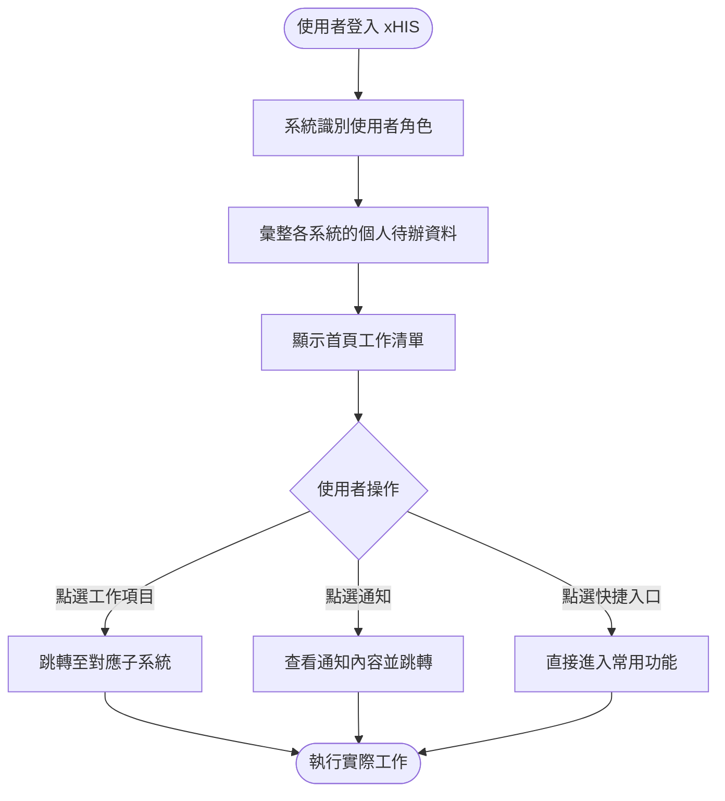
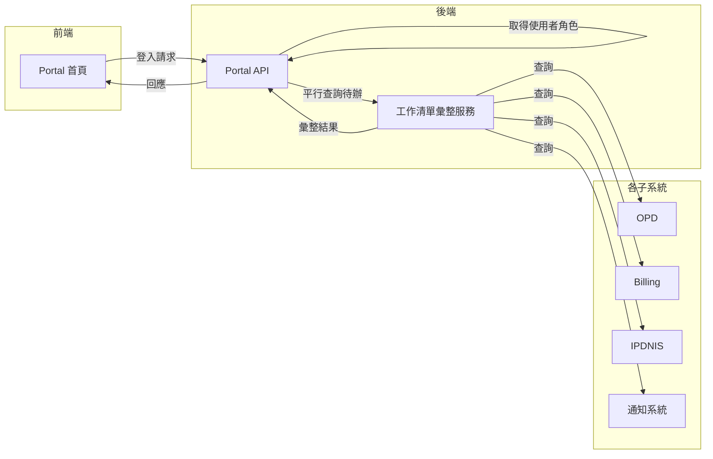

# 【範例】首頁工作清單 PRD

> ⚠️ **本文件為 PRD 撰寫參考範例，非正式需求文件，不可作為研發實作依據。**

## 文件資訊

| 欄位 | 內容 |
|-----|-----|
| 所屬系統 | Portal 首頁系統 |
| 版本 | 1.0 |
| 作者 | PM 範例 |
| 建立日期 | 2026-05-07 |
| 最後更新 | 2026-05-07 |
| 狀態 | ✅ 內部審核通過 |

---

## 1. Change History｜修訂紀錄

| Version | Date | Author | Description |
|---------|------|--------|-------------|
| 1.0 | 2026-05-07 | PM 範例 | 初版建立（範例文件） |

---

## 2. Requirement Overview｜需求概述

### 2.1 背景與目的

xHIS 使用者（醫師、護理師、行政人員）每天登入系統後，需分別進入多個子系統查看各自的待辦工作（待完診的病患、待執行的醫令、待批價的就診等）。目前缺乏統一的入口，使用者需記憶各系統的路徑，效率低且容易遺漏。

本 PRD 定義 xHIS 首頁工作清單，登入後依角色顯示個人化的今日工作清單，一鍵跳轉至對應子系統操作。

### 2.2 目標與範疇

**目標（Goals）**

- [ ] 登入後 3 秒內顯示完整個人工作清單
- [ ] 工作清單依角色自動客製化（醫師 / 護理師 / 行政分別顯示不同內容）
- [ ] 提供未讀通知摘要，一鍵跳轉至對應功能

**範疇內（In Scope）**

- 角色化工作清單（待辦事項彙整）
- 快捷功能入口
- 系統通知中心

**範疇外（Out of Scope）**

- 各子系統的功能本身（各子系統各自的 PRD 處理）
- 報表與統計功能（另一 PRD）

### 2.3 目標使用者（Target Users）

| 角色 | 描述 | 主要操作情境 |
|-----|-----|------------|
| 門診醫師 | 需查看今日診次與待看病患 | 登入後確認今日診程 |
| 護理師 | 需查看待執行醫令與護理記錄 | 接班時確認今日工作 |
| 批價人員 | 需查看待批價清單 | 登入後開始批價作業 |

### 2.4 非功能需求（Non-functional Requirements）

| 類型 | 需求說明 |
|-----|---------|
| 效能 | 首頁載入時間 < 3 秒（含工作清單資料） |
| 安全性 | 工作清單僅顯示當前登入使用者有權限查看的資料 |
| 相容性 | 支援 Chrome / Edge 最新兩版；RWD 支援 1280px 以上解析度 |
| 可用性 | 全日 24 小時可用率 ≥ 99.9% |

---

## 3. Business Flow Overview｜業務流程概觀

### 3.1 流程圖

### 3.2 流程步驟說明

| 步驟 | 執行角色 | 動作描述 | 備註 |
|-----|--------|---------|-----|
| 1 | 系統 | 登入後依角色與權限決定顯示內容 | |
| 2 | 系統 | 從各子系統 API 彙整當日待辦工作 | 平行呼叫，控制在 3 秒內完成 |
| 3 | 使用者 | 瀏覽工作清單，點選項目跳轉 | |
| 4 | 系統 | 背景持續更新通知（每 30 秒拉取一次） | |

### 3.3 與其他系統的互動

| 觸發方向 | 來源系統 | 目標系統 | 互動說明 |
|---------|--------|--------|---------|
| ← | Portal | OPD / ER / IPD | 讀取醫師待看診病患數 |
| ← | Portal | IPDNIS / ERNIS | 讀取護理師待執行醫令數 |
| ← | Portal | Billing | 讀取批價人員待批價清單數 |
| ← | Portal | 通知系統 | 讀取未讀通知 |

---

## 4. Data Flow Overview｜資料流程概觀

### 4.1 資料流程圖

### 4.2 關鍵資料項目

| 資料名稱 | 說明 | 來源 | 格式／長度 | 必填 |
|---------|-----|-----|----------|-----|
| 角色代碼 | 使用者的系統角色 | 帳號系統 | 角色代碼 | 是 |
| 待辦項目清單 | 各類工作項目的數量與摘要 | 各子系統 API | JSON 陣列 | 是 |
| 未讀通知數 | 未讀取的系統通知數量 | 通知系統 | 整數 | 是 |
| 快捷功能設定 | 使用者個人化的快捷入口 | 使用者設定（本地儲存）| JSON 陣列 | 否 |

### 4.3 API／介接規格

| API 端點 | 方法 | 說明 | 主要參數 |
|---------|-----|-----|--------|
| `/api/v1/portal/worklist` | GET | 取得個人工作清單 | `userId`, `date` |
| `/api/v1/portal/notifications` | GET | 取得未讀通知 | `userId`, `unreadOnly` |

---

## 5. Use Cases｜使用案例含 UI 與規格說明

---

### UC-01｜門診醫師登入後查看今日工作清單

**角色（Actor）：** 門診醫師

**前置條件（Preconditions）：**
- 使用者已完成登入驗證
- 當日有排定的門診診次

**後置條件（Postconditions）：**
- 醫師看到今日待看診病患數、未讀通知，可直接跳轉至 OPD

---

#### 5.1.1 操作流程（Main Flow）

| 步驟 | 使用者動作 | 系統回應 |
|-----|---------|--------|
| 1 | 完成帳號密碼登入 | 載入首頁，顯示今日工作清單（含進度條動畫） |
| 2 | 查看「今日診次」卡片 | 顯示診次名稱、已看 / 待看病患數 |
| 3 | 點選診次卡片 | 跳轉至 OPD 診間列表，自動選取對應診次 |
| 4 | 查看通知中心 | 顯示未讀通知清單（轉診回應、檢驗報告等） |
| 5 | 點選通知項目 | 跳轉至對應功能頁面 |

**例外流程（Exception Flow）：**

| 情境 | 觸發條件 | 系統處理方式 |
|-----|--------|-----------|
| 子系統 API 無回應 | 某子系統查詢逾時 | 顯示該區塊為「資料暫時無法取得，請稍後重試」，其他區塊正常顯示 |
| 今日無排診 | 醫師當天無門診 | 診次卡片顯示「今日無門診排程」 |

---

#### 5.1.2 UI 畫面參考

- **Figma 連結：** `（請填入 Figma 連結）`
- **畫面說明：**
  - **頂部通知列**：未讀通知鈴鐺圖示 + 數量角標
  - **主要工作區**：依角色顯示對應卡片（醫師：今日診次 / 待開立醫令；護理師：待執行醫令 / 待記錄評估；批價：待批價清單）
  - **快捷入口區**：使用者可自訂的常用功能捷徑（最多 8 個）

---

#### 5.1.3 欄位與互動規格（Spec）

| 元件 | 類型 | 說明 | 驗證規則 | 必填 |
|-----|-----|-----|--------|-----|
| 診次卡片 | 可點擊卡片 | 顯示診次摘要，點擊跳轉 | — | — |
| 通知鈴鐺 | 圖示 + 角標 | 未讀數 > 99 顯示「99+」 | — | — |
| 快捷入口 | 可拖曳圖示 | 最多 8 個，可自訂順序 | — | — |
| 工作清單刷新 | 每 30 秒自動觸發 | 背景靜默更新，不影響使用者操作 | — | — |

**業務規則（Business Rules）：**

- BR-01：工作清單僅顯示當日資料；跨日作業（如急診）顯示當前班別時段
- BR-02：使用者無任何待辦工作時，顯示「今日工作已完成」鼓勵提示
- BR-03：快捷入口設定儲存於使用者設定，更換裝置後保留

---

## 6. Test Cases｜測試案例

| TC ID | 對應 UC | 測試情境 | 前置條件 | 測試步驟 | 預期結果 | 優先級 |
|-------|--------|---------|--------|---------|--------|------|
| TC-01 | UC-01 | 醫師登入顯示今日診次 | 醫師當日有門診 | 1. 登入 | 首頁 3 秒內顯示今日診次卡片與病患數 | P0 |
| TC-02 | UC-01 | 點選診次跳轉 OPD | 醫師已在首頁 | 1. 點選診次卡片 | 跳轉至 OPD 並自動選取對應診次 | P0 |
| TC-03 | UC-01 | 子系統 API 逾時 | 某子系統無回應 | 1. 登入（模擬某子系統逾時） | 該卡片顯示「資料暫時無法取得」，其他區塊正常 | P1 |
| TC-04 | UC-01 | 今日無排診 | 醫師當日無門診 | 1. 登入 | 診次卡片顯示「今日無門診排程」 | P1 |
| TC-05 | UC-01 | 通知角標顯示正確 | 醫師有 5 筆未讀通知 | 1. 登入查看通知圖示 | 鈴鐺角標顯示「5」 | P1 |
