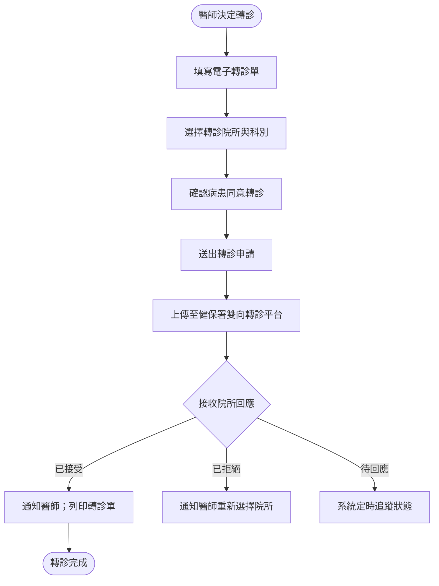
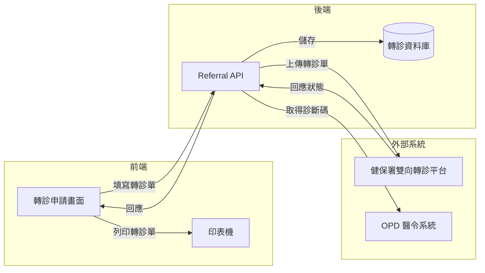

# 【範例】轉診申請作業 PRD

> ⚠️ **本文件為 PRD 撰寫參考範例，非正式需求文件，不可作為研發實作依據。**

## 文件資訊

| 欄位 | 內容 |
|-----|-----|
| 所屬系統 | Referral 轉診系統 |
| 版本 | 1.0 |
| 作者 | PM 範例 |
| 建立日期 | 2026-05-07 |
| 最後更新 | 2026-05-07 |
| 狀態 | ✅ 內部審核通過 |

---

## 1. Change History｜修訂紀錄

| Version | Date | Author | Description |
|---------|------|--------|-------------|
| 1.0 | 2026-05-07 | PM 範例 | 初版建立（範例文件） |

---

## 2. Requirement Overview｜需求概述

### 2.1 背景與目的

醫師需將病患轉介至其他醫療機構時，目前以紙本填寫轉診單，再由行政人員傳真或郵寄，過程耗時且無法追蹤轉診狀態，接收醫院也無法即時確認是否收到轉診資料。

本 PRD 定義電子轉診申請作業，透過健保署雙向轉診平台實現電子化轉診，並提供轉診狀態追蹤。

### 2.2 目標與範疇

**目標（Goals）**

- [ ] 醫師可在系統內完成轉診單填寫與電子送出，不需紙本
- [ ] 轉診狀態（待確認 / 已接受 / 已拒絕）即時顯示
- [ ] 接收院所確認後，轉診摘要自動傳送至接收院所

**範疇內（In Scope）**

- 轉診單電子填寫
- 上傳至健保署雙向轉診平台
- 轉診狀態查詢與追蹤

**範疇外（Out of Scope）**

- 接收院所的接收端介面（接收功能另一 PRD）
- 院內轉科作業（床管系統處理）

### 2.3 目標使用者（Target Users）

| 角色 | 描述 | 主要操作情境 |
|-----|-----|------------|
| 門診 / 急診醫師 | 提出轉診申請的醫師 | 診察後判斷需轉診時開立轉診單 |
| 診間護理師 | 協助確認轉診作業完成 | 列印轉診單交給病患 |

### 2.4 非功能需求（Non-functional Requirements）

| 類型 | 需求說明 |
|-----|---------|
| 效能 | 轉診單上傳至健保署平台 < 10 秒 |
| 安全性 | 轉診資料傳輸使用 TLS 加密；病患同意書需記錄 |
| 相容性 | 支援健保署雙向轉診 API 規格（最新版） |
| 可用性 | 門診時段可用率 ≥ 99.5% |

---

## 3. Business Flow Overview｜業務流程概觀

### 3.1 流程圖

### 3.2 流程步驟說明

| 步驟 | 執行角色 | 動作描述 | 備註 |
|-----|--------|---------|-----|
| 1 | 醫師 | 填寫轉診原因、診斷、需轉診的科別 | 診斷碼自動帶入當次就診診斷 |
| 2 | 醫師 | 從院所清單選擇轉診目標院所與科別 | 系統提供鄰近院所清單 |
| 3 | 護理師 / 醫師 | 確認病患口頭同意轉診，勾選同意記錄 | |
| 4 | 系統 | 上傳轉診資料至健保署平台 | |
| 5 | 系統 | 收到接收院所回應後通知醫師 | |
| 6 | 護理師 | 接受後列印轉診單給病患 | |

### 3.3 與其他系統的互動

| 觸發方向 | 來源系統 | 目標系統 | 互動說明 |
|---------|--------|--------|---------|
| → | Referral | 健保署雙向轉診平台 | 上傳電子轉診單 |
| ← | Referral | 健保署雙向轉診平台 | 接收院所回應狀態 |
| ← | Referral | OPD / ER | 帶入當次就診診斷碼 |

---

## 4. Data Flow Overview｜資料流程概觀

### 4.1 資料流程圖

### 4.2 關鍵資料項目

| 資料名稱 | 說明 | 來源 | 格式／長度 | 必填 |
|---------|-----|-----|----------|-----|
| 轉診原因 | 轉診的臨床理由 | 醫師輸入 | 文字 500 字 | 是 |
| 主診斷碼 | ICD-10-CM 診斷碼 | 自動帶入 / 醫師修改 | ICD-10 格式 | 是 |
| 轉診科別 | 請求接收的科別 | 醫師選擇 | 科別代碼 | 是 |
| 接收院所 | 轉診目標醫療機構 | 醫師選擇（院所清單） | 醫療機構代碼 | 是 |
| 病患同意記錄 | 病患口頭同意轉診的紀錄 | 護理師 / 醫師勾選 | Boolean + 時間戳 | 是 |

### 4.3 API／介接規格

| API 端點 | 方法 | 說明 | 主要參數 |
|---------|-----|-----|--------|
| `/api/v1/referral/submit` | POST | 送出轉診申請 | `visitId`, `targetHospital`, `targetDept`, `reason` |
| `/api/v1/referral/status` | GET | 查詢轉診狀態 | `referralId` |

---

## 5. Use Cases｜使用案例含 UI 與規格說明

---

### UC-01｜醫師填寫電子轉診單並送出

**角色（Actor）：** 門診醫師

**前置條件（Preconditions）：**
- 醫師已登入，具備「轉診開立」權限
- 病患有當次門診就診紀錄

**後置條件（Postconditions）：**
- 轉診單上傳至健保署平台，等候接收院所回應
- 轉診記錄建立於系統，可追蹤狀態

---

#### 5.1.1 操作流程（Main Flow）

| 步驟 | 使用者動作 | 系統回應 |
|-----|---------|--------|
| 1 | 在就診頁面點選「開立轉診單」 | 帶入就診基本資料與診斷碼，顯示轉診單填寫頁面 |
| 2 | 填寫或確認轉診原因 | — |
| 3 | 選擇目標院所（搜尋或依縣市篩選）與科別 | — |
| 4 | 確認病患同意轉診（勾選同意欄位） | — |
| 5 | 點選「送出轉診申請」 | 上傳至健保署平台，顯示上傳進度；完成後顯示轉診編號 |

**例外流程（Exception Flow）：**

| 情境 | 觸發條件 | 系統處理方式 |
|-----|--------|-----------|
| 健保署平台無回應 | 上傳逾時 | 提示上傳失敗，轉診資料暫存，允許稍後重試 |
| 病患未同意 | 同意欄位未勾選 | 送出按鈕鎖定，提示「需確認病患同意才可送出」 |

---

#### 5.1.2 UI 畫面參考

- **Figma 連結：** `（請填入 Figma 連結）`
- **畫面說明：**
  - **表單上方**：病患資訊（唯讀）、診斷碼自動帶入
  - **院所搜尋**：關鍵字搜尋 + 縣市 / 科別篩選
  - **轉診狀態追蹤頁**：清單顯示所有轉診申請，含狀態（待回應 / 已接受 / 已拒絕）

---

#### 5.1.3 欄位與互動規格（Spec）

| 元件 | 類型 | 說明 | 驗證規則 | 必填 |
|-----|-----|-----|--------|-----|
| 轉診原因 | 文字輸入 | 自動帶入診斷說明，可修改 | 20 字以上 | 是 |
| 目標院所 | 搜尋選擇 | 健保署特約醫療機構清單 | 必選 | 是 |
| 目標科別 | 下拉選單 | 依選取院所篩選可用科別 | 必選 | 是 |
| 病患同意 | 核取方塊 | 醫師或護理師確認病患已同意 | 必勾才可送出 | 是 |

**業務規則（Business Rules）：**

- BR-01：同一就診只能開立一張有效轉診單；如需修改，需先作廢舊單
- BR-02：轉診單上傳後 48 小時內接收院所未回應，系統自動提醒醫師確認
- BR-03：病患同意記錄需記錄確認時間與操作人員帳號

---

## 6. Test Cases｜測試案例

| TC ID | 對應 UC | 測試情境 | 前置條件 | 測試步驟 | 預期結果 | 優先級 |
|-------|--------|---------|--------|---------|--------|------|
| TC-01 | UC-01 | 正常送出轉診申請 | 病患有就診紀錄 | 1. 開立轉診單 2. 填寫原因 3. 選院所 4. 同意 5. 送出 | 上傳成功，顯示轉診編號 | P0 |
| TC-02 | UC-01 | 未勾選同意無法送出 | — | 1. 填寫完整轉診單 2. 未勾同意 3. 嘗試送出 | 送出按鈕鎖定，顯示提示訊息 | P0 |
| TC-03 | UC-01 | 健保署平台上傳失敗 | 健保署平台無回應 | 1. 完整填寫 2. 點送出 | 顯示上傳失敗，資料暫存，允許重試 | P1 |
| TC-04 | UC-01 | 轉診狀態追蹤 | 已成功送出轉診申請 | 1. 開啟轉診追蹤清單 | 顯示轉診編號、目標院所、目前狀態 | P1 |
