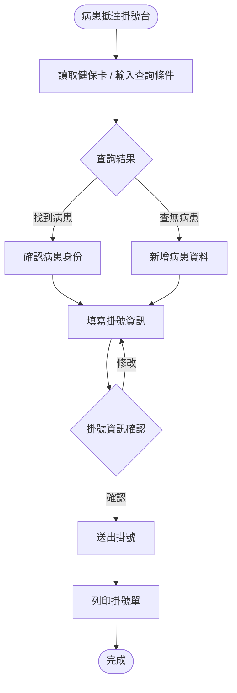
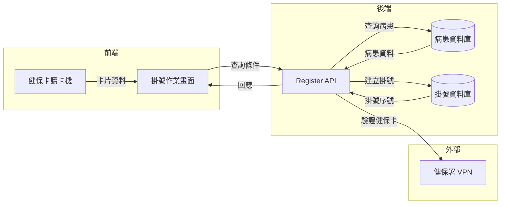

# 【範例】病患查詢與掛號作業 PRD

> ⚠️ **本文件為 PRD 撰寫參考範例，非正式需求文件，不可作為研發實作依據。**

## 文件資訊

| 欄位 | 內容 |
|-----|-----|
| 所屬系統 | Register 掛號系統 |
| 版本 | 1.0 |
| 作者 | PM 範例 |
| 建立日期 | 2026-05-07 |
| 最後更新 | 2026-05-07 |
| 狀態 | ✅ 內部審核通過 |

---

## 1. Change History｜修訂紀錄

| Version | Date | Author | Description |
|---------|------|--------|-------------|
| 1.0 | 2026-05-07 | PM 範例 | 初版建立（範例文件） |

---

## 2. Requirement Overview｜需求概述

### 2.1 背景與目的

掛號作業是醫院服務的第一個接觸點。目前掛號人員需在多個欄位輸入病患資料後才能完成查詢，遇到同名同姓病患時容易找錯人，且查無結果時也無法快速新建病患，導致掛號時間過長，尖峰時段排隊情況嚴重。

本 PRD 定義「病患查詢與掛號作業」功能，讓掛號人員能快速查詢病患基本資料，並在確認身份後完成當次掛號。

### 2.2 目標與範疇

**目標（Goals）**

- [ ] 掛號人員可透過多種條件（身分證號、健保卡號、姓名、出生日期）查詢病患
- [ ] 查到病患後，一頁完成掛號資訊填寫與送出
- [ ] 查無病患時，可快速跳轉至新增病患流程

**範疇內（In Scope）**

- 病患查詢（多條件組合查詢）
- 掛號資訊填寫（科別、醫師、診別）
- 掛號完成後列印掛號單

**範疇外（Out of Scope）**

- 線上預約掛號（由另一 PRD 處理）
- 自助報到機的掛號流程（硬體端處理）

### 2.3 目標使用者（Target Users）

| 角色 | 描述 | 主要操作情境 |
|-----|-----|------------|
| 掛號人員 | 醫院前台服務人員 | 協助病患現場掛號 |
| 護理師 | 診間護理站人員 | 確認掛號清單時偶爾查詢 |

### 2.4 非功能需求（Non-functional Requirements）

| 類型 | 需求說明 |
|-----|---------|
| 效能 | 查詢結果須於 1 秒內回應；掛號送出須於 2 秒內完成 |
| 安全性 | 病患個資僅限有掛號作業權限的帳號存取；操作記錄寫入稽核日誌 |
| 相容性 | 支援 Chrome、Edge 最新兩版；螢幕解析度 1280×800 以上 |
| 可用性 | 系統可用率 ≥ 99.5%；健保卡讀卡機需支援 USB 介接 |

---

## 3. Business Flow Overview｜業務流程概觀

### 3.1 流程圖

### 3.2 流程步驟說明

| 步驟 | 執行角色 | 動作描述 | 備註 |
|-----|--------|---------|-----|
| 1 | 掛號人員 | 刷讀病患健保卡或手動輸入查詢條件 | 健保卡為優先查詢方式 |
| 2 | 系統 | 顯示符合條件的病患清單 | 最多顯示 20 筆 |
| 3 | 掛號人員 | 確認病患身份（比對姓名、生日） | 同名同姓需加注出生日期確認 |
| 4 | 掛號人員 | 填寫掛號資訊（科別、醫師、診別） | |
| 5 | 系統 | 送出掛號並產生掛號序號 | |
| 6 | 掛號人員 | 列印掛號單交給病患 | |

### 3.3 與其他系統的互動

| 觸發方向 | 來源系統 | 目標系統 | 互動說明 |
|---------|--------|--------|---------|
| → | Register | OPD / ER | 掛號完成後，該診次資訊寫入診間候診清單 |
| ← | Register | 健保署 VPN | 讀卡驗證健保卡有效性 |

---

## 4. Data Flow Overview｜資料流程概觀

### 4.1 資料流程圖

### 4.2 關鍵資料項目

| 資料名稱 | 說明 | 來源 | 格式／長度 | 必填 |
|---------|-----|-----|----------|-----|
| 身分證號 | 病患唯一識別碼 | 使用者輸入 / 健保卡 | 英數 10 碼 | 否（查詢條件擇一） |
| 健保卡號 | 健保卡卡號 | 讀卡機 | 數字 12 碼 | 否 |
| 姓名 | 病患姓名 | 使用者輸入 | 中文 2–10 字 | 否 |
| 出生日期 | 輔助確認身份 | 使用者輸入 | YYYY-MM-DD | 否 |
| 掛號科別 | 欲就診的科別 | 使用者選擇（下拉） | 科別代碼 | 是 |
| 掛號醫師 | 欲就診的醫師 | 使用者選擇（下拉） | 醫師代碼 | 是 |
| 診別 | 初診 / 複診 | 系統自動判斷，可人工修改 | 代碼 1 碼 | 是 |

### 4.3 API／介接規格

| API 端點 | 方法 | 說明 | 主要參數 |
|---------|-----|-----|--------|
| `/api/v1/patients/search` | GET | 病患查詢 | `idno`, `nhic`, `name`, `birthdate` |
| `/api/v1/registrations` | POST | 建立掛號 | `patientId`, `deptCode`, `doctorCode`, `visitType` |

---

## 5. Use Cases｜使用案例含 UI 與規格說明

---

### UC-01｜以健保卡查詢病患並完成掛號

**角色（Actor）：** 掛號人員

**前置條件（Preconditions）：**
- 使用者已登入且具備「掛號作業」權限
- 健保卡讀卡機已連接並完成初始化
- 欲掛號的診別（門診）當日有開診

**後置條件（Postconditions）：**
- 掛號資料寫入系統，病患出現於對應診間候診清單
- 掛號單印出並交給病患

---

#### 5.1.1 操作流程（Main Flow）

| 步驟 | 使用者動作 | 系統回應 |
|-----|---------|--------|
| 1 | 將病患健保卡插入讀卡機 | 自動讀取卡號並填入查詢欄位，觸發查詢 |
| 2 | 確認畫面顯示的病患清單 | 顯示符合條件的病患清單（姓名、生日、病歷號） |
| 3 | 點選正確的病患姓名 | 帶入病患基本資料，進入掛號資訊填寫區 |
| 4 | 選擇科別、醫師 | 醫師下拉清單依科別篩選；診別由系統自動判斷 |
| 5 | 點選「確認掛號」 | 顯示掛號確認彈窗（病患姓名、科別、醫師、序號） |
| 6 | 點選「送出」 | 掛號成功，顯示掛號序號，觸發掛號單列印 |

**例外流程（Exception Flow）：**

| 情境 | 觸發條件 | 系統處理方式 |
|-----|--------|-----------|
| 讀卡失敗 | 健保卡無法讀取 | 顯示「讀卡失敗，請改以手動輸入查詢條件」提示，切換為手動輸入模式 |
| 查無病患 | 查詢結果為空 | 顯示「查無病患，是否新增病患資料？」，提供「新增病患」按鈕 |
| 重複掛號 | 同病患當診次已掛號 | 顯示警告「此病患今日已掛同診次，確認是否繼續？」，需二次確認 |
| 診別已截止 | 當日掛號已額滿或截止 | 顯示「今日門診已截止掛號」，不允許送出 |

---

#### 5.1.2 UI 畫面參考

- **Figma 連結：** `（請填入 Figma 連結）`
- **畫面說明：**
  - **初始畫面**：上方為查詢區（健保卡號、身分證號、姓名、生日），下方為空白結果清單
  - **查詢結果**：清單顯示姓名、生日、病歷號，最多 20 筆，同名者以不同底色區分
  - **掛號填寫區**：病患資訊區（唯讀）+ 掛號資訊區（科別下拉、醫師下拉、診別）

---

#### 5.1.3 欄位與互動規格（Spec）

| 元件 | 類型 | 說明 | 驗證規則 | 必填 |
|-----|-----|-----|--------|-----|
| 健保卡號輸入框 | 文字輸入 | 可手動輸入或由讀卡機帶入 | 12 位數字 | 否 |
| 身分證號輸入框 | 文字輸入 | 支援居留證格式 | 英數 10 碼，格式驗證 | 否 |
| 姓名輸入框 | 文字輸入 | 支援模糊查詢（含 2 字以上） | 中文 2 字以上 | 否 |
| 科別下拉 | 下拉選單 | 僅顯示當日有開診的科別 | 必選一項 | 是 |
| 醫師下拉 | 下拉選單 | 依選取科別篩選 | 必選一項 | 是 |
| 診別 | 唯讀 + 可覆寫 | 系統依就診紀錄自動帶入初/複診 | 僅限「初診」「複診」 | 是 |
| 確認掛號 | 主要按鈕 | 科別與醫師均已選取才可點擊 | — | — |

**業務規則（Business Rules）：**

- BR-01：查詢條件至少須填一項；若僅填姓名，需同時填入出生日期才可查詢
- BR-02：同一病患同一診別（門診/急診）同一日只能掛同一科一次，重複時需人工確認
- BR-03：診別判斷邏輯：過去 365 天內同科有就診紀錄者為「複診」，否則為「初診」

---

## 6. Test Cases｜測試案例

| TC ID | 對應 UC | 測試情境 | 前置條件 | 測試步驟 | 預期結果 | 優先級 |
|-------|--------|---------|--------|---------|--------|------|
| TC-01 | UC-01 | 健保卡讀卡成功並完成掛號 | 讀卡機正常；病患有健保卡；當日門診開診 | 1. 插入健保卡 2. 確認清單病患 3. 選科別與醫師 4. 送出 | 掛號成功，顯示序號，觸發列印 | P0 |
| TC-02 | UC-01 | 手動輸入身分證號查詢 | 病患存在系統中 | 1. 輸入正確身分證號 2. 點查詢 3. 選病患 4. 選科別醫師 5. 送出 | 掛號成功 | P0 |
| TC-03 | UC-01 | 姓名查詢有多筆同名病患 | 系統中有同名病患 | 1. 輸入姓名 2. 查詢 | 清單顯示多筆，並以不同底色區分；需加填生日才可查詢 | P1 |
| TC-04 | UC-01 | 健保卡讀卡失敗 | 讀卡機連線但卡片損壞 | 1. 插入損壞健保卡 | 顯示讀卡失敗提示，切換手動輸入模式 | P1 |
| TC-05 | UC-01 | 重複掛號警告 | 病患當日已掛同診次 | 1. 查詢同一病患 2. 選同科別 3. 嘗試送出 | 顯示重複掛號警告彈窗，需二次確認才可送出 | P0 |
| TC-06 | UC-01 | 查無病患 | 系統中無此病患資料 | 1. 輸入不存在的身分證號 2. 查詢 | 顯示「查無病患」，出現新增病患按鈕 | P1 |
