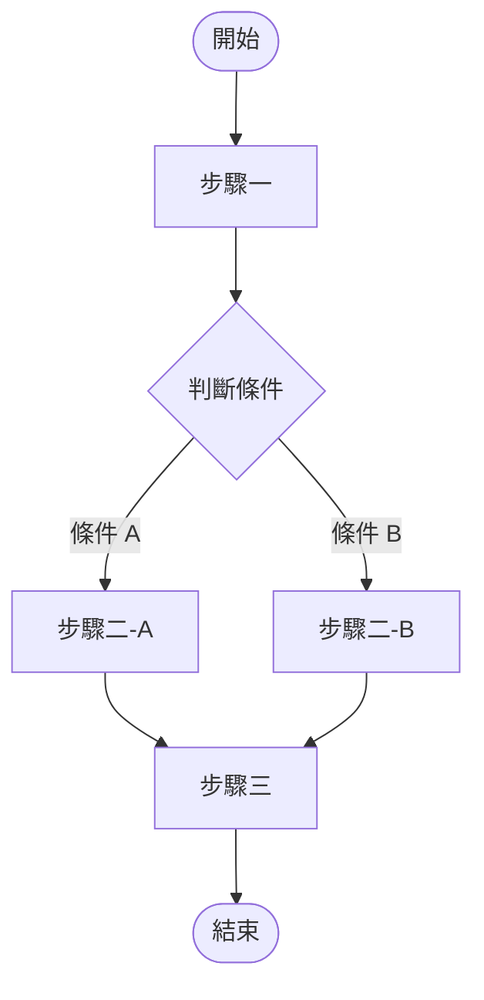
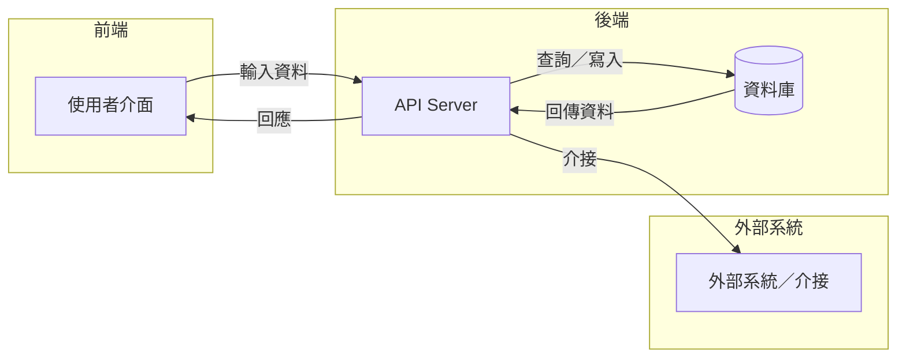

# [功能名稱] PRD

## 文件資訊

| 欄位 | 內容 |
|-----|-----|
| 所屬系統 | [系統代碼] [系統名稱] |
| 版本 | 1.0 |
| 作者 | [PM 姓名] |
| 建立日期 | YYYY-MM-DD |
| 最後更新 | YYYY-MM-DD |
| 狀態 | 📝 編輯中 |

---

## 1. Change History｜修訂紀錄

> 每次版本更新均須在此補充一筆紀錄，版本號格式：主版號.次版號（例如 1.0、1.1、2.0）。
> - **主版號**：需求範疇異動、大幅改寫
> - **次版號**：局部修正、補充說明、錯字修訂

| Version | Date | Author | Description |
|---------|------|--------|-------------|
| 1.0 | YYYY-MM-DD | [PM 姓名] | 初版建立 |

---

## 2. Requirement Overview｜需求概述

### 2.1 背景與目的

> 說明業務背景與問題痛點：目前的流程有什麼不足？這個功能要解決什麼問題？

### 2.2 目標與範疇

**目標（Goals）**

- [ ] 目標一
- [ ] 目標二

**範疇內（In Scope）**

- 功能一
- 功能二

**範疇外（Out of Scope）**

- 排除項目一（說明排除理由）

### 2.3 目標使用者（Target Users）

| 角色 | 描述 | 主要操作情境 |
|-----|-----|------------|
| [角色名稱] | [角色說明] | [何時使用此功能] |

### 2.4 非功能需求（Non-functional Requirements）

| 類型 | 需求說明 |
|-----|---------|
| 效能 | 例：頁面回應時間 < 2 秒 |
| 安全性 | 例：操作須驗證使用者權限 |
| 相容性 | 例：支援 Chrome / Edge 最新兩版 |
| 可用性 | 例：系統可用率 ≥ 99.5% |

---

## 3. Business Flow Overview｜業務流程概觀

> 以全貌視角描述此功能涉及的端到端業務流程，聚焦在「人做了什麼事、觸發什麼動作、產生什麼結果」。
> 不需涵蓋所有細節，詳細規格請見第 5 節各 Use Case。

### 3.1 流程圖

> 提示：可使用 [Mermaid Live Editor](https://mermaid.live/) 預覽圖表，完成後貼回此處。

### 3.2 流程步驟說明

| 步驟 | 執行角色 | 動作描述 | 備註 |
|-----|--------|---------|-----|
| 1 | [角色] | [動作] | |
| 2 | [角色] | [動作] | |

### 3.3 與其他系統的互動

> 說明此功能需要與哪些外部系統或模組互動（例如：OPD 觸發後 Pharmacy 接收醫令）。

| 觸發方向 | 來源系統 | 目標系統 | 互動說明 |
|---------|--------|--------|---------|
| → | [來源] | [目標] | [說明] |

---

## 4. Data Flow Overview｜資料流程概觀

> 描述資料如何在系統元件間流動，重點在於「誰產生了什麼資料、傳給誰、存在哪裡」。

### 4.1 資料流程圖

### 4.2 關鍵資料項目

| 資料名稱 | 說明 | 來源 | 格式／長度 | 必填 |
|---------|-----|-----|----------|-----|
| [欄位名稱] | [說明] | [來源系統或使用者輸入] | [格式] | 是／否 |

### 4.3 API／介接規格

> 如有對外 API 或與其他系統介接，在此列出端點、方法與主要參數。無介接需求可刪除此節。

| API 端點 | 方法 | 說明 | 主要參數 |
|---------|-----|-----|--------|
| `/api/v1/[endpoint]` | GET / POST | [說明] | [參數名稱] |

---

## 5. Use Cases｜使用案例含 UI 與規格說明

> 每個 Use Case 對應一個完整的使用情境，從使用者進入頁面到完成操作的全過程。
> 每個 Use Case 需包含：操作流程、UI 畫面、欄位與互動規格、例外處理。

---

### UC-01｜[Use Case 名稱]

**角色（Actor）：** [使用者角色]

**前置條件（Preconditions）：**
- 條件一（例：使用者已登入且具備 XX 權限）
- 條件二

**後置條件（Postconditions）：**
- 成功情境下系統的狀態變化

---

#### 5.1.1 操作流程（Main Flow）

| 步驟 | 使用者動作 | 系統回應 |
|-----|---------|--------|
| 1 | [使用者做了什麼] | [系統顯示或執行什麼] |
| 2 | | |

**替代流程（Alternative Flow）：**

> 說明非主線情境，例如使用者選擇了不同選項。

**例外流程（Exception Flow）：**

> 說明錯誤情境的處理，例如資料驗證失敗、系統無回應等。

| 情境 | 觸發條件 | 系統處理方式 |
|-----|--------|-----------|
| [錯誤情境] | [何時發生] | [錯誤訊息或處理行為] |

---

#### 5.1.2 UI 畫面參考

> 附上 Figma 連結或截圖。每個頁面狀態（初始、填寫中、送出成功、錯誤）都應有對應畫面。

- **Figma 連結：** [貼上連結]
- **頁面截圖：**

  > 可直接拖曳圖片至此處，或附上圖片路徑 ``

---

#### 5.1.3 欄位與互動規格（Spec）

| 元件 | 類型 | 說明 | 驗證規則 | 必填 |
|-----|-----|-----|--------|-----|
| [欄位名稱] | 文字輸入 / 下拉 / 按鈕… | [用途說明] | [格式、長度、允許值] | 是／否 |

**業務規則（Business Rules）：**

- BR-01：[規則描述，例如：同一病患同一診次只能掛號一次]
- BR-02：

---

> 如有多個 Use Case，複製以上區塊（UC-01 整個段落）並依序編號 UC-02、UC-03…

---

## 6. Test Cases｜測試案例

> 測試案例由 PM 定義驗收標準，作為 QA 測試與 UAT 的依據。
> 每筆 Test Case 對應一個可被驗證的情境，結果須明確且可重現。

| TC ID | 對應 UC | 測試情境 | 前置條件 | 測試步驟 | 預期結果 | 優先級 |
|-------|--------|---------|--------|---------|--------|------|
| TC-01 | UC-01 | [正常流程情境描述] | [前置條件] | 1. [步驟一] 2. [步驟二] | [系統應顯示或執行的結果] | P0 |
| TC-02 | UC-01 | [邊界值或例外情境] | | | | P1 |
| TC-03 | UC-02 | | | | | P1 |

**優先級定義：**
- **P0**：核心功能，UAT 必測，不通過不上線
- **P1**：重要功能，正常情況下應通過
- **P2**：邊界情境或低頻使用情境，允許次版本修正
