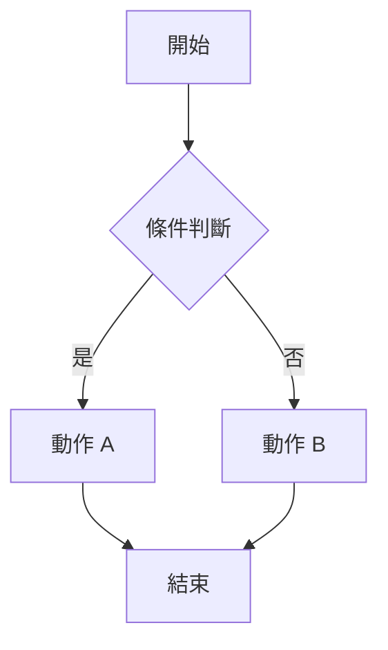

# [功能名稱] PRD

## 文件資訊

| 欄位 | 內容 |
|-----|-----|
| 所屬系統 | [系統代碼] [系統名稱] |
| 版本 | 1.0 |
| 作者 | [PM 姓名] |
| 建立日期 | YYYY-MM-DD |
| 最後更新 | YYYY-MM-DD |
| 狀態 | 📝 編輯中 |

---

## 1. 背景與目的

> 說明此功能的業務背景、問題痛點，以及為何需要開發此功能。

## 2. 目標

- [ ] 目標一
- [ ] 目標二

## 3. 目標用戶

| 角色 | 描述 |
|-----|-----|
| [角色名稱] | [角色說明] |

## 4. 使用情境（User Stories）

```
身為 [角色]，
我想要 [操作/功能]，
以便 [達成的目的]。
```

> 可依需求列出多條 User Story。

## 5. 功能需求

### 5.1 [子功能名稱]

**描述：**

**驗收條件（AC）：**
- AC1：
- AC2：

### 5.2 [子功能名稱]

**描述：**

**驗收條件（AC）：**
- AC1：

## 6. 非功能需求

| 類型 | 需求說明 |
|-----|---------|
| 效能 | |
| 安全性 | |
| 相容性 | |
| 可用性 | |

## 7. UI/UX 設計參考

> 附上 Figma 連結、線稿截圖，或說明頁面流程。

## 8. 流程說明

> 可附上流程圖（Mermaid 語法）或文字描述操作流程。



## 9. 資料規格

> 說明涉及的資料欄位、格式、來源，或 API 介接規格。

## 10. 例外與邊界處理

| 情境 | 處理方式 |
|-----|---------|
| [例外情境] | [對應處理] |

## 11. 開放問題

| # | 問題 | 負責人 | 截止日期 | 狀態 |
|---|-----|--------|---------|-----|
| 1 | | | | 待決定 |

## 12. 修訂紀錄

| 版本 | 日期 | 修改人 | 修改摘要 |
|-----|------|-------|---------|
| 1.0 | YYYY-MM-DD | [PM 姓名] | 初版建立 |
